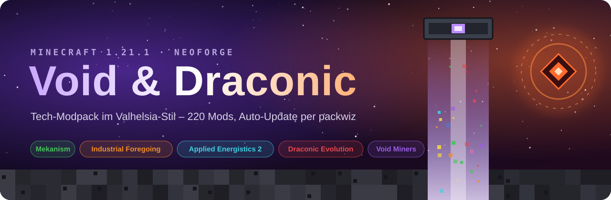
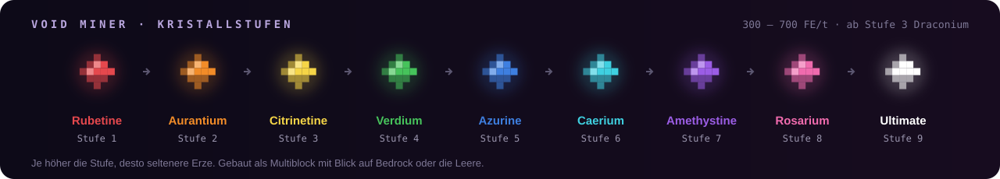
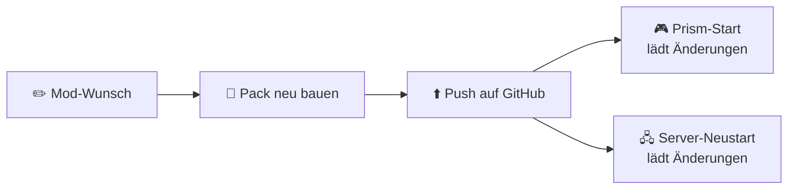

<p align="center"></p>

<p align="center">
  
  
  
  
  
  
</p>

<p align="center">
  <a href="#ueberblick"><b>Überblick</b></a> ·
  <a href="#kern"><b>Kern-Mods</b></a> ·
  <a href="#performance"><b>Performance</b></a> ·
  <a href="#installation"><b>Installation</b></a> ·
  <a href="#server"><b>Server</b></a> ·
  <a href="#updates"><b>Updates</b></a> ·
  <a href="#mods"><b>Alle Mods</b></a>
</p>

> [!NOTE]
> **Void & Draconic** ist ein privates Tech-Modpack für eine kleine Runde von 2 bis 5 Spielern. Vorbild ist Valhelsia: viel Technik, Automatisierung und Erkundung, dazu Magie und Deko. Herzstück ist ein Nachfolger des alten *Void Ore Miners* aus Environmental Tech.

<a name="ueberblick"></a>


| | |
|---|---|
| 🧩 **Mods gesamt** | **357**, davon 283 mit Inhalt und 74 Bibliotheken. Dazu 3 Shaderpacks. |
| 🖧 **Server** | 318 Mods. Die 39 reinen Client-Mods lässt der Server weg, 6 Mods laufen nur auf dem Server. |
| 📦 **Quellen** | 305 von Modrinth, 52 von CurseForge |
| 🏰 **Herkunft** | 109 Mods aus den alten Valhelsia-Packs, dazu Botania mit 8 Addons |
| 📜 **Quests** | 85 Quests in FTB Quests, gemeinsam im Team |
| ⛏️ **Erze** | Keine doppelten Metalle: Blei und Uran nur von Mekanism, Silber nur von Immersive Engineering. Almost Unified gibt Mekanism in Rezepten Vorrang. |
| 🎮 **Spieler** | 2 bis 5, mit AFK-Farmen und dauerhaft geladenen Chunks |
| 🧠 **RAM** | Client 8–10 GB, Server 16 GB |
| 🔄 **Updates** | Automatisch bei jedem Start über packwiz |

> [!NOTE]
> **Seit 08.10.2026 auf Minecraft 1.20.1 mit Forge.** Gegenüber dem alten 1.21.1-Pack ersetzt: Sodium und Iris durch Embeddium und Oculus, Refined Storage 2 durch Refined Storage 1.12, Void Miners Remastered durch Voidminer Reforked. Entfernt: MineColonies, C2ME (für Forge 1.20.1 nur als Alpha, hängt mit diesem Pack), Functional Storage, Ore Excavation, Dynamic Surroundings, Engineer's Decor, Sound Control.


<a name="kern"></a>


| Mod | Wofür |
|---|---|
| **[Mekanism](https://modrinth.com/mod/Ce6I4WUE)** + Generators, Tools, Additions, Extras, More Machine | Erzverarbeitung bis 5×, Fusionsreaktor, MekaSuit |
| **[Industrial Foregoing](https://modrinth.com/mod/lWxpUd04)** | Laser Drill, Mob- und Pflanzen-Automatisierung |
| **[Refined Storage 1.12](https://modrinth.com/mod/KDvYkUg3)** + Extra Storage, Extra Disks, Cable Tiers, Universal Grid, RS Addons, Requestify | Lagersystem mit Autocrafting. Requestify hält Items auf Vorrat und bestellt automatisch nach. |
| **[Draconic Evolution](https://modrinth.com/mod/nBqivi8H)** | Draconic-Reaktor, Energy Core, Fusion Crafting, Endgame-Rüstung |
| **[Voidminer Reforked](https://www.curseforge.com/projects/1415764)** | Nachfolger des Void Ore Miners: Multiblock, der Erze aus der Leere holt. Ersetzt Void Miners Remastered. |
| **[Create](https://modrinth.com/mod/LNytGWDc)**, **[Immersive Engineering](https://modrinth.com/mod/tIm2nV03)**, **[Powah](https://modrinth.com/mod/KZO4S4DO)**, **[Ender IO](https://modrinth.com/mod/49ZofO4f)**, **[Just Dire Things](https://modrinth.com/mod/just-dire-things-forge)** | Mechanik, Multiblock-Maschinen, Strom, Conduits und Automatisierung |

<p align="center"></p>

### Was sonst noch drin ist

- 💾 **Lagersystem (Refined Storage)** (10): Refined Storage, Refined Storage Addons, ExtraStorage, Extra Disks, Cable Tiers, Universal Grid, Requestify …
- 🔌 **Weitere Technik** (30): Powah!, Immersive Engineering, Ender IO, Just Dire Things, Flux Networks, PneumaticCraft …
- 🏭 **Create** (3): Create, Create Crafts & Additions, Sophisticated Backpacks Create Integration
- ✨ **Magie** (27): Botania mit AIOT Botania, MythicBotany, ExtraBotany und weiteren Addons, Ars Nouveau, Blood Magic, Eidolon, Psi, Occultism, Iron's Spells …
- 🗺️ **Erkundung & Dungeons** (61): Twilight Forest, The Aether, Blue Skies, The Bumblezone, Deeper and Darker, The Abyss II, BetterEnd, Cataclysm, Cracker's Wither Storm …
- 🪑 **Deko & Bauen** (44): Valhelsia Furniture, Macaw's, Chipped, Supplementaries, Chisels & Bits, Farmer's Delight …
- 🎒 **Komfort** (81): JEI, Jade, FTB Quests, FTB Chunks, FTB Ultimine, Ring of Teleport, Angel Ring 2, Tool Belt, Storage Drawers, GraveStone …
- 🚀 **Performance & Grafik** (22): Embeddium, Oculus, ModernFix, FerriteCore, Canary, Connectivity …
- 🔍 **Analyse & Debugging** (4): spark, Observable, Crash Assistant, BetterF3

<a name="performance"></a>


Ein Pack mit 357 Mods braucht Optimierung. 22 Mods kümmern sich darum, dazu kommen 4 Werkzeuge zur Analyse.

<table>
<tr><th>🖥️ Nur im Client (mehr FPS)</th><th>🖧 Client und Server (TPS, RAM, Stabilität)</th></tr>
<tr><td valign="top">

- **Embeddium**: Deutlich mehr FPS. Ersetzt Sodium.
- **Rubidium Extra**: Mehr Grafikoptionen für Embeddium und ein FPS-Overlay.
- **Oculus**: Shader-Unterstützung, ersetzt Iris. Complementary Reimagined, Complementary Unbound und BSL sind dabei.
- **ImmediatelyFast**: Schnelleres Zeichnen von Text und Oberflächen.
- **Entity Culling**: Zeichnet nichts, was hinter Wänden liegt.
- **BadOptimizations**: Viele kleine Optimierungen bei Licht und Himmel.
- **Dynamic FPS**: Drosselt das Spiel im Hintergrund, ideal beim AFK-Farmen.
- **Better Biome Blend**: Schnellere, weichere Farbübergänge zwischen Biomen.

</td><td valign="top">

- **ModernFix**: Schnellerer Start, weniger RAM.
- **FerriteCore**: Weniger RAM-Verbrauch.
- **AllTheLeaks**: Behebt Speicherlecks verschiedener Mods.
- **Canary**: Forge-Port von Lithium. Optimiert Mobs, Physik und Server-Ticks.
- **Structure Layout Optimizer**: Schnellere Generierung großer Strukturen.
- **FastSuite**: Schnellere Rezeptsuche in Maschinen.
- **FastWorkbench**: Schnellere Werkbank und Autocrafting.
- **FastFurnace**: Schnellere Rezeptsuche in Öfen.
- **Let Me Despawn**: Mobs mit aufgehobenen Items verschwinden trotzdem. Weniger Entities.
- **Packet Fixer**: Verhindert Kicks bei großen Grids und vollen Rucksäcken.
- **Neruina**: Fängt fehlerhafte Mobs und Blöcke ab, statt die Welt abstürzen zu lassen.
- **Connectivity**: Behebt Verbindungsabbrüche. Login-Timeout 120 s und Verbindungs-Timeout 180 s, weil JEI beim ersten Join rund 40 s lädt.
- **Noisium**: Nur Server. Schnellere Gelände-Berechnung bei der Weltgenerierung.
- **AI Improvements**: Nur Server. Schnellere Mob-KI.

</td></tr>
</table>

> [!TIP]
> **Shader:** In den Videoeinstellungen unter *Shader Packs* Complementary Reimagined, Complementary Unbound oder BSL wählen. Kostet je nach Grafikkarte deutlich FPS.

**Analyse & Debugging**

- **spark**: Profiler für TPS, MSPT, RAM und Lag-Verursacher. Pflicht.
- **Observable**: Zeigt Lag als Heatmap direkt in der Welt.
- **Crash Assistant**: Nur Client. Erklärt Abstürze und lädt Logs zum Teilen hoch.
- **BetterF3**: Nur Client. Aufgeräumter F3-Bildschirm.

> [!TIP]
> Lag? `/spark tps` zeigt die Auslastung. `/spark profiler start --timeout 120` findet die Farm, die am meisten Leistung frisst.

<details><summary><b>Optional, nicht im Pack</b></summary>

Kann bei Bedarf dazukommen. Vorher prüfen, ob es eine Version für Forge 1.20.1 gibt und ob sie sich mit Embeddium und Oculus verträgt.

- **[Distant Horizons](https://modrinth.com/mod/distanthorizons)**: Nur Client. Sehr weite Sicht, braucht starke Grafikkarte und viel RAM.
- **[Fast IP Ping](https://modrinth.com/mod/fast-ip-ping)**: Nur Client. Server-Liste lädt schneller.
- **[Ksyxis](https://modrinth.com/mod/ksyxis)**: Welt lädt beim Betreten schneller.
- **[Alternate Current](https://modrinth.com/mod/alternate-current)**: Schnellere Redstone-Berechnung.
- **[Log Begone](https://modrinth.com/mod/log-begone)**: Filtert Log-Spam, damit echte Fehler auffallen.

</details>


<a name="installation"></a>


Empfohlen: **[Prism Launcher](https://prismlauncher.org/)**. Einmal importieren, danach kommt jedes Update von allein.

### ⚡ Schnell: fertige Instanz importieren

1. In Prism oben links auf **Instanz hinzufügen** klicken und links **Importieren** wählen.
2. Diesen Link einfügen und mit **OK** bestätigen:

   ```
   https://github.com/Bresqwik/void-draconic-pack/releases/latest/download/Void-Draconic-Prism.zip
   ```

3. **Starten.** Beim ersten Mal lädt ein Fenster alle Mods, das dauert ein paar Minuten. Danach werden bei jedem Start nur noch Änderungen geladen.
4. **Mitspielen:** Unter *Mehrspieler* steht **Void & Draconic** schon in der Liste. Fehlt der Eintrag, weil die Instanz schon eine eigene Serverliste hatte, einmal von Hand hinzufügen: `mc-void-draconic.duckdns.org`

Startbefehl, 10 GB RAM und Forge sind schon eingestellt. Java 17 lädt Prism bei Bedarf selbst herunter (sonst unter *Einstellungen* → *Java*).

> **Umstieg von 1.21.1:** Seit Version 0.4 läuft das Pack auf Minecraft 1.20.1 mit Forge. Die alte Instanz bitte nicht mehr starten, sondern die neue ZIP importieren.

<p align="center"><a href="https://github.com/Bresqwik/void-draconic-pack/releases/latest/download/Void-Draconic-Prism.zip"></a></p>

<details><summary><b>Von Hand einrichten</b></summary>

1. **Neue Instanz:** In Prism *Instanz hinzufügen* wählen, dann Minecraft **1.20.1** und als Mod-Loader **Forge 47.4.26**.
2. **Bootstrap laden:** [`packwiz-installer-bootstrap.jar`](https://github.com/packwiz/packwiz-installer-bootstrap/releases/latest) herunterladen und in den Ordner `minecraft` der Instanz legen. Den Ordner öffnet ein Rechtsklick auf die Instanz → *Ordner*.
3. **Startbefehl eintragen:** Rechtsklick auf die Instanz → *Bearbeiten* → *Einstellungen* → *Eigene Befehle*. Haken setzen und bei *Befehl vor dem Start* eintragen:

   ```
   "$INST_JAVA" -jar packwiz-installer-bootstrap.jar https://raw.githubusercontent.com/Bresqwik/void-draconic-pack/main/pack.toml
   ```

4. **Speicher:** Unter *Einstellungen* → *Java* den Wert *Maximaler Speicher* auf **8192–10240 MB** setzen.
5. **Starten.** Beim ersten Mal lädt ein Fenster alle Mods, das dauert ein paar Minuten. Danach werden bei jedem Start nur noch Änderungen geladen.

</details>


<a name="server"></a>


**Adresse:** `mc-void-draconic.duckdns.org` · Mietserver bei Tube-Hosting mit 12 Kernen und Debian 12, davon 16 GB RAM für Minecraft. Whitelist ist an.

- **Backups:** alle 4 Stunden, solange gespielt wird, dazu täglich um 04:00. Jedes Backup wird nach Google Drive hochgeladen, dort per Größe und MD5 geprüft und erst dann auf dem Server gelöscht. Backups liegen also nur in Google Drive.
- **Dashboard:** Weboberfläche mit Login für Spieler, TPS, RAM, Backups und Vorgenerierung.
- **Vorgenerierung:** Chunky generiert die Welt im Voraus. Ein Wächter pausiert das, sobald jemand online ist, und macht nach dem letzten Logout weiter.

> [!TIP]
> **Betrieb und Neuaufbau:** Bedienung, Backups, Zurückspielen und Zugangsdaten stehen in [`SERVER-START.md`](SERVER-START.md). Auf einem frischen Linux-Server baut ein einziger Befehl den kompletten Stand nach (Minecraft, Dashboard, Backups, DuckDNS):
>
> ```bash
> curl -fsSL https://raw.githubusercontent.com/Bresqwik/void-draconic-pack/main/server/setup-linux.sh -o setup-linux.sh && ACCEPT_EULA=yes bash setup-linux.sh
> ```

| Bereich | Minimum | Empfohlen |
|---|---|---|
| Prozessor | 4 Kerne mit guter Einzelkernleistung | 6+ Kerne über 4,5 GHz, keine geteilten vCPUs |
| RAM für Minecraft | 12 GB | 16 GB, so läuft unser Server |
| RAM im Rechner | 16 GB | 24–32 GB |
| Speicher | 50 GB SSD | 100–200 GB NVMe plus Backup-Ziel woanders |
| Java | 17 | Eclipse Temurin 17 |
| Ports | 25565 TCP | dazu 24454 UDP für Simple Voice Chat |

**Voreinstellungen** aus dem Server-Paket: Whitelist an, Fliegen erlaubt, Sichtweite 10, Simulationsweite 8, kein Spawn-Schutz.

**Werkzeuge für Admins**

| Mod | Wofür |
|---|---|
| FTB Chunks | Claims und Forceload, standardmäßig 25 Chunks pro Spieler. Damit Farmen offline weiterlaufen: `force_load_mode = always` |
| FTB Ranks + FTB Essentials | Ränge und Rechte, `/home`, `/tpa`, `/back`, `/spawn` |
| Simple Backups | Automatische Welt-Backups |
| Chunky | Welt vorgenerieren. Auf dem Server am einfachsten über den Pregen-Rechner im Dashboard, sonst `chunky radius 3000`, dann `chunky start` |
| spark + Observable | Lag finden |

**Auto-Update:** Die Startskripte in [`server/`](server/) laden vor jedem Start die neueste Pack-Version. Client-Mods lassen sie dabei weg. Von Hand geht das so:

```
java -jar packwiz-installer-bootstrap.jar -g -s server https://raw.githubusercontent.com/Bresqwik/void-draconic-pack/main/pack.toml
```

<details><summary><b>Die 39 reinen Client-Mods</b> (nicht auf dem Server)</summary>

- `AmbientSounds_FORGE_v6.3.10_mc1.20.1.jar`
- `athena-forge-1.20.1-3.1.2.jar`
- `BadOptimizations-2.4.1-1.20.1.jar`
- `BetterAdvancements-Forge-1.20.1-0.6.0.73.jar`
- `betterbiomeblend-forge-1.20.1-1.4.0.jar`
- `BetterF3-7.0.2-Forge-1.20.1.jar`
- `BetterTitleScreen-1.20-1.13.2.jar`
- `bwncr-forge-1.20.1-3.17.2.jar`
- `catalogue-forge-1.20.1-1.8.0.jar`
- `chat_heads-0.15.7-forge-1.20.jar`
- `cherishedworlds-forge-6.1.7+1.20.1.jar`
- `clienttweaks-forge-1.20.1-11.1.11.jar`
- `Controlling-forge-1.20.1-12.0.2.jar`
- `CrashAssistant-forge-1.19-1.20.1-1.11.12.jar`
- `Ding-1.20.1-Forge-1.5.0.jar`
- `DrawersTooltip-1.20.1-forge-8.0.0.jar`
- `dynamic-fps-3.11.4+minecraft-1.20.0-forge.jar`
- `embeddium-0.3.31+mc1.20.1.jar`
- `Enchanted-Book-Redesign-forge-1.20.1-0.jar`
- `entityculling-forge-1.11.3-mc1.20.1.jar`
- `fusion-1.3.16-forge-mc1.20.1.jar`
- `ImmediatelyFast-Forge-1.5.5+1.20.4.jar`
- `inventoryhud.forge.1.20.1-3.4.26.jar`
- `InventoryProfilesNext-forge-1.20-1.10.20.jar`
- `jeed-1.20-2.2.6.jar`
- `Just-Enough-Botania-1.20.1-v0.2.1.jar`
- `JustEnoughResources-1.20.1-1.4.0.247.jar`
- `libIPN-forge-1.20-4.0.2.jar`
- `MouseTweaks-forge-mc1.20.1-2.25.1.jar`
- `Neat-1.20.1-41-FORGE.jar`
- `Notes-1.20.1-1.3.0-forge.jar`
- `oculus-mc1.20.1-1.8.0.jar`
- `overloadedarmorbar-1.20.1-1.jar`
- `rubidium-extra-0.5.4.4+mc1.20.1-build.131.jar`
- `seamless-loading-screen-2.0.3+1.20.1-forge.jar`
- `Searchables-forge-1.20.1-1.0.3.jar`
- `SimpleRPC-4.1.4.jar`
- `ToastControl-1.20.1-8.0.3.jar`
- `toughnessbar-1.20.1-9.jar`

Dazu kommen die 3 Shaderpacks, die ebenfalls nur im Client liegen.

</details>


<a name="updates"></a>




> [!IMPORTANT]
> Client und Server müssen dieselbe Version haben. Nach einem Update also beide neu starten.


<a name="mods"></a>


⭐ Lieblingsmod · 🖥️ nur im Client · Die aktuelle Liste mit Versionen steht auch im Server-Dashboard unter *Modliste*.

<details><summary><b>⚙️ Kern-Technik</b> · 12</summary>

*Eure Lieblinge und der Void Miner. Das ist das Herz des Packs.*

| Mod | Info | Quelle |
|---|---|---|
| [Mekanism](https://modrinth.com/mod/Ce6I4WUE) ⭐ | Maschinen, Erzverarbeitung bis 5×, MekaSuit. | Modrinth |
| [Mekanism Generators](https://modrinth.com/mod/OFVYKsAk) ⭐ | Turbine, Spalt- und Fusionsreaktor. | Modrinth |
| [Mekanism Tools](https://modrinth.com/mod/tqQpq1lt) | Werkzeuge und Rüstung aus Osmium und anderen Metallen. | Modrinth |
| [Mekanism Additions](https://modrinth.com/mod/a6F3uASn) | Aus Valhelsia. Plastikblöcke, Leuchtpaneele, Ballons und mehr. | Modrinth |
| [Mekanism Extras](https://www.curseforge.com/projects/1026040) | Höhere Stufen für Leitungen, Tanks und Factories. | CurseForge |
| [Mekanism: More Machine](https://modrinth.com/mod/qDJXZJTz) | Zusätzliche Mekanism-Maschinen. | Modrinth |
| [Industrial Foregoing](https://modrinth.com/mod/lWxpUd04) ⭐ | Laser Drill, Mob-Farmen, Pflanzen-Automatisierung. | Modrinth |
| [Titanium](https://modrinth.com/mod/1Ro7m06l) | Für Industrial Foregoing. | Modrinth |
| [Draconic Evolution](https://modrinth.com/mod/nBqivi8H) ⭐ | Draconic-Reaktor, Energy Core, Fusion Crafting, Endgame-Rüstung. | Modrinth |
| [Brandon's Core](https://modrinth.com/mod/iFDWVIFV) | Für Draconic Evolution. | Modrinth |
| [CodeChicken Lib](https://modrinth.com/mod/2gq0ALnz) | Für Draconic Evolution. | Modrinth |
| [Voidminer Reforked](https://www.curseforge.com/projects/1415764) ⭐ | Nachfolger des Void Ore Miners: 9 Kristallstufen von Rubetine bis Ultimate, Multiblock, Solar-Arrays und Modifikatoren. Ersetzt Void Miners Remastered. | CurseForge |

</details>

<details><summary><b>💾 Lagersystem (Refined Storage)</b> · 10</summary>

*Refined Storage 1.12 mit Addons: größere Disks, schnellere Busse, Wireless Grids und automatisches Nachbestellen.*

| Mod | Info | Quelle |
|---|---|---|
| [Refined Storage](https://modrinth.com/mod/KDvYkUg3) ⭐ | Das Lagersystem: Disks, Grids und Autocrafting, übersichtlicher als AE2. Version 1.12. | Modrinth |
| [Refined Storage Addons](https://modrinth.com/mod/Z4Z5ccuT) | Aus Valhelsia. Wireless Crafting Grid und weitere Erweiterungen. | Modrinth |
| [ExtraStorage](https://modrinth.com/mod/T34cBZKl) | Größere Disks, schnellere Crafter, erweiterte Importer und Exporter. | Modrinth |
| [EdivadLib](https://modrinth.com/mod/a8Jk9kpK) | Für ExtraStorage. | Modrinth |
| [Extra Disks](https://modrinth.com/mod/Tlo2tahX) | Aus Valhelsia. Weitere Speicher-Disks in höheren Stufen. | Modrinth |
| [Cable Tiers](https://modrinth.com/mod/UsLNxQgK) | Schnellere Importer, Exporter, Constructor und Crafter in mehreren Stufen. | Modrinth |
| [Universal Grid](https://modrinth.com/mod/kpMfA312) | Ein Wireless-Grid für alle Grid-Arten. | Modrinth |
| [Refined Storage: Requestify](https://modrinth.com/mod/dSxaHfLO) | Aus Valhelsia. Requester-Block: hält Items auf Vorrat und bestellt per Autocrafting automatisch nach. | Modrinth |
| [PackagedAuto](https://modrinth.com/mod/ugIdhQx4) | Autocrafting für große Rezepte. | Modrinth |
| [PackagedDraconic](https://modrinth.com/mod/dNduUQBR) | Automatisiert Draconic Fusion Crafting mit PackagedAuto. | Modrinth |

</details>

<details><summary><b>🔌 Weitere Technik</b> · 30</summary>

*Strom, Transport und Werkzeuge, die gut mit Mekanism und Refined Storage zusammenspielen.*

| Mod | Info | Quelle |
|---|---|---|
| [Powah!](https://modrinth.com/mod/KZO4S4DO) | Einfacher Strom früh im Spiel, Reaktoren und Energiezellen. | Modrinth |
| [Flux Networks](https://www.curseforge.com/projects/248020) | Kabelloser Strom über die ganze Basis und Dimensionen. | CurseForge |
| [Immersive Engineering](https://modrinth.com/mod/tIm2nV03) | Große Multiblock-Maschinen im Industrie-Look. Blei- und Uranerz sind abgeschaltet (kommen von Mekanism). | Modrinth |
| [Ender IO](https://modrinth.com/mod/49ZofO4f) | Conduits, Alloy Smelter, SAG Mill. | Modrinth |
| [XNet](https://modrinth.com/mod/iu1jkWqa) | Logistik-Netzwerk für Items, Flüssigkeiten und Strom. | Modrinth |
| [Pipez](https://modrinth.com/mod/iRmWy6ga) | Einfache, schnelle Rohre. | Modrinth |
| [Laser IO](https://www.curseforge.com/projects/626839) | Kabelloser Item- und Flüssigkeitstransport mit Filtern. | CurseForge |
| [Hostile Neural Networks](https://modrinth.com/mod/6bLUlbZn) | Mob-Drops ohne Mob-Farm simulieren. | Modrinth |
| [Just Dire Things [Forge]](https://modrinth.com/mod/just-dire-things-forge) | Werkzeuge, Generatoren und Automatisierungsblöcke von Direwolf20. | Modrinth |
| [Mining Gadgets](https://www.curseforge.com/projects/351748) | Abbau-Laser mit Upgrades. | CurseForge |
| [Iron Jetpacks](https://modrinth.com/mod/DWIEOniQ) | Jetpacks schon früh im Spiel, in Stufen aufrüstbar, mit FE-Strom. Kommt in den Curios-Slot. | Modrinth |
| [Pocket Storage](https://www.curseforge.com/projects/367734) | Tragbarer Massenspeicher von Flanks255 (bis 1 Mio. Items pro Slot). Nicht die gleichnamige Mod auf Modrinth. | CurseForge |
| [Building Gadgets 2](https://www.curseforge.com/projects/298187) | Große Flächen und Kopien auf einmal bauen. Auf CurseForge heißt das Projekt nur „Building Gadgets“. | CurseForge |
| [PneumaticCraft: Repressurized](https://modrinth.com/mod/ncAcdgk7) | Aus Valhelsia 3. Druckluft-Technik, Drohnen, Ölverarbeitung. | Modrinth |
| [Immersive Petroleum](https://modrinth.com/mod/MOw5TN6u) | Aus Valhelsia 3. Öl und Diesel für Immersive Engineering. | Modrinth |
| [Immersive Posts](https://modrinth.com/mod/UXrbgsTE) | Aus Valhelsia 3. Strommasten für Immersive Engineering. | Modrinth |
| [Ender Storage](https://www.curseforge.com/projects/245174) | Aus Valhelsia 3. Farbcodierte Ender-Truhen und -Tanks, praktisch zum Teilen. | CurseForge |
| [Torchmaster](https://modrinth.com/mod/Tl8ESrhX) | Aus Valhelsia 3. Verhindert Mob-Spawns in großem Radius. | Modrinth |
| [Botany Pots](https://modrinth.com/mod/U6BUTZ7K) | War ein Extra. Pflanzen automatisch in Töpfen anbauen. | Modrinth |
| [Botany Pots Tiers](https://modrinth.com/mod/fvMhZPuf) | War ein Extra. Schnellere Töpfe. | Modrinth |
| [Botany Trees](https://modrinth.com/mod/mvs7RoIW) | Aus der Mod-Wahl. Bäume in Botany Pots anbauen. | Modrinth |
| [Cyclic](https://modrinth.com/mod/UcVTWyCI) | Aus der RAR. Viele kleine Maschinen, Werkzeuge und Blöcke. | Modrinth |
| [FLIB](https://modrinth.com/mod/FAUSd09K) | Für Cyclic. | Modrinth |
| [RFTools Utility](https://modrinth.com/mod/7n3HbHSE) | Aus der RAR. Teleporter, Bildschirme, Umgebungsmodule. | Modrinth |
| [RFTools Builder](https://modrinth.com/mod/e0IclJLr) | Aus der RAR. Builder und Quarry mit Shape Cards. | Modrinth |
| [CC: Tweaked](https://modrinth.com/mod/gu7yAYhd) | Aus der Mod-Wahl. Programmierbare Computer und Turtles. | Modrinth |
| [Advanced Peripherals](https://modrinth.com/mod/SOw6jD6x) | Aus der Mod-Wahl. Verbindet CC: Tweaked mit Mekanism und mehr. | Modrinth |
| [Dark Utilities](https://modrinth.com/mod/CkqTAIaP) | Aus der Mod-Wahl. Mob-Fallen, Vektorplatten, nützliche Kleinigkeiten. | Modrinth |
| [Little Logistics](https://modrinth.com/mod/1zZJrh9c) | Aus Valhelsia. Boote, Schleppkähne und Züge für automatischen Transport. | Modrinth |
| [Elevator Mod](https://modrinth.com/mod/hi2dSXTu) | Aus Valhelsia. Aufzugsblöcke: Springen fährt nach oben, Schleichen nach unten. | Modrinth |

</details>

<details><summary><b>🏭 Create</b> · 3</summary>

*Mechanische Automatisierung, wie in Valhelsia.*

| Mod | Info | Quelle |
|---|---|---|
| [Create](https://modrinth.com/mod/LNytGWDc) | Zahnräder, Förderbänder, Züge. | Modrinth |
| [Create Crafts & Additions](https://modrinth.com/mod/kU1G12Nn) | Verbindet Create mit FE-Strom. | Modrinth |
| [Sophisticated Backpacks Create Integration](https://modrinth.com/mod/s85zLEDe) | Aus der Mod-Wahl. Rucksäcke auf Create-Fahrzeugen. | Modrinth |

</details>

<details><summary><b>✨ Magie</b> · 27</summary>

*Botania mit Addons, Ars Nouveau, Blood Magic und weitere Magie-Mods, viele davon mit Anbindung an Automatisierung.*

| Mod | Info | Quelle |
|---|---|---|
| [Botania](https://modrinth.com/mod/pfjLUfGv) | Natur-Magie mit Mana, Funktionsblumen und viel Automatisierung. Offizielle Version 1.20.1-456. | Modrinth |
| [AIOT Botania](https://modrinth.com/mod/TFFWPTSD) | All-in-One-Werkzeuge aus Botania-Materialien. | Modrinth |
| [MythicBotany](https://modrinth.com/mod/7tl2Pt3c) | Aus Valhelsia. Erweitert Botania um Alfheim, neue Blumen und Runen. | Modrinth |
| [ExtraBotany](https://modrinth.com/mod/zG0IqeQj) | Weitere Blumen, Ausrüstung und Endgame-Inhalte für Botania. | Modrinth |
| [Ars-Botania](https://modrinth.com/mod/beexc33H) | Verbindet Ars Nouveau mit Botania. | Modrinth |
| [Botania Slots](https://modrinth.com/mod/GjeTMb9Z) | Eigene Ausrüstungs-Slots für Botania-Gegenstände. | Modrinth |
| [Botania Seeds](https://modrinth.com/mod/pJA93SOk) | Ergänzt Botania um Samen. | Modrinth |
| [Just Enough Botania](https://modrinth.com/mod/9V5kkHHH) 🖥️ | Nur Client. Zusätzliche Botania-Infos in JEI. | Modrinth |
| [Botania Backpack Upgrades](https://modrinth.com/mod/sznyZ26h) | Rucksack-Upgrades mit Botania-Funktionen. | Modrinth |
| [Ars Nouveau](https://modrinth.com/mod/TKB6INcv) | Zauber selbst zusammenbauen. War auch in Valhelsia. | Modrinth |
| [Ars Elemental](https://www.curseforge.com/projects/561470) | Aus Valhelsia. Elementar-Foki und weitere Zauber für Ars Nouveau. | CurseForge |
| [Blood Magic](https://modrinth.com/mod/PbNc6qBY) | Aus Valhelsia. Blutaltar, Rituale und Sigillen. | Modrinth |
| [Eidolon: Repraised](https://modrinth.com/mod/eWX2m1eM) | Dunkle Magie mit Ritualen, Nekromantie und Gebeten. | Modrinth |
| [Psi](https://modrinth.com/mod/pOeA0exL) | Aus Valhelsia. Programmierbare Zauber, zusammengesetzt aus Spell-Pieces. | Modrinth |
| [Nature's Aura](https://modrinth.com/mod/4cJkN3aF) | Aus Valhelsia. Magie, die von der natürlichen Aura der Umgebung lebt. | Modrinth |
| [Tetra](https://modrinth.com/mod/YP9DjOvN) | Aus Valhelsia. Modulare Werkzeuge und Waffen, aus Einzelteilen gebaut. | Modrinth |
| [Mystical Agriculture](https://modrinth.com/mod/C95ReXie) | Ressourcen als Pflanzen anbauen. | Modrinth |
| [Mystical Agradditions](https://modrinth.com/mod/pl0jGXIx) | Höhere Stufen für Mystical Agriculture. | Modrinth |
| [Occultism](https://modrinth.com/mod/sbJh4AZw) | Geister beschwören, die für euch arbeiten und sortieren. Silbererz ist abgeschaltet (kommt von Immersive Engineering). | Modrinth |
| [Iron's Spells 'n Spellbooks](https://modrinth.com/mod/s4OWxYQQ) | Kampfmagie mit Bossen und Zauberbüchern. | Modrinth |
| [playerAnimator](https://modrinth.com/mod/gedNE4y2) | Für Iron's Spells. | Modrinth |
| [Iron's Lib](https://modrinth.com/mod/9nfaJPtX) | Für Iron's Spells. | Modrinth |
| [Forbidden & Arcanus](https://modrinth.com/mod/MdlnLS7Q) | Dunkle Magie und Rituale. | Modrinth |
| [Apotheosis](https://modrinth.com/mod/rqFWfVlz) | Besseres Verzaubern, Edelsteine, Beute-Affixe. | Modrinth |
| [Ensorcellation](https://modrinth.com/mod/ImlP9deQ) | Aus Valhelsia. Zusätzliche Verzauberungen. | Modrinth |
| [Allurement](https://modrinth.com/mod/eIO12l2t) | Aus Valhelsia. Zusätzliche Verzauberungen. | Modrinth |
| [Magic Combat Wands](https://www.curseforge.com/projects/534351) | Aus Valhelsia. Zauberstäbe für den Kampf. | CurseForge |

</details>

<details><summary><b>🗺️ Erkundung & Dungeons</b> · 61</summary>

*Strukturen, Biome, Dimensionen, Mobs, Bosse und Ausrüstung. Valhelsia Structures sorgt für das bekannte Valhelsia-Gefühl.*

| Mod | Info | Quelle |
|---|---|---|
| [Valhelsia Structures](https://modrinth.com/mod/T21szC0a) ⭐ | Die Strukturen aus den Valhelsia-Packs. | Modrinth |
| [YUNG's API](https://modrinth.com/mod/Ua7DFN59) | Für alle YUNG's-Mods. | Modrinth |
| [YUNG's Better Dungeons](https://modrinth.com/mod/o1C1Dkj5) | – | Modrinth |
| [YUNG's Better Mineshafts](https://modrinth.com/mod/HjmxVlSr) | – | Modrinth |
| [YUNG's Better Strongholds](https://modrinth.com/mod/kidLKymU) | – | Modrinth |
| [YUNG's Better Nether Fortresses](https://modrinth.com/mod/Z2mXHnxP) | – | Modrinth |
| [YUNG's Better Ocean Monuments](https://modrinth.com/mod/3dT9sgt4) | – | Modrinth |
| [YUNG's Better Desert Temples](https://modrinth.com/mod/XNlO7sBv) | – | Modrinth |
| [YUNG's Better Jungle Temples](https://modrinth.com/mod/z9Ve58Ih) | – | Modrinth |
| [YUNG's Better End Island](https://modrinth.com/mod/2BwBOmBQ) | – | Modrinth |
| [YUNG's Better Caves](https://modrinth.com/mod/Dfu00ggU) | Aus der Mod-Wahl. Überarbeitete Höhlen mit Seen und Flüssen. | Modrinth |
| [YUNG's Extras](https://modrinth.com/mod/ZYgyPyfq) | Aus der Mod-Wahl. Euer altes Extra. Kleine Strukturen. | Modrinth |
| [Terralith](https://modrinth.com/mod/8oi3bsk5) | Über 100 neue Biome ohne neue Blöcke. | Modrinth |
| [Tectonic](https://modrinth.com/mod/lWDHr9jE) | Berge, Täler und tiefere Ozeane. | Modrinth |
| [Biomes O' Plenty](https://modrinth.com/mod/HXF82T3G) | Aus der Mod-Wahl. Über 50 Biome. Zusammen mit Terralith und Oh The Biomes We've Gone wird die Weltgenerierung schwerer. | Modrinth |
| [Oh The Biomes We've Gone](https://modrinth.com/mod/NTi7d3Xc) | Aus der Mod-Wahl. Nachfolger von Oh The Biomes You'll Go (euer altes Extra). | Modrinth |
| [Explorify](https://modrinth.com/mod/HSfsxuTo) | Kleine Vanilla-Strukturen überall. | Modrinth |
| [Towns and Towers](https://modrinth.com/mod/DjLobEOy) | Bessere Dörfer und Außenposten. | Modrinth |
| [Dungeons and Taverns](https://modrinth.com/mod/tpehi7ww) | Tavernen, Ruinen und Dungeons. | Modrinth |
| [When Dungeons Arise](https://modrinth.com/mod/8DfbfASn) | Riesige Dungeons und Schlösser. | Modrinth |
| [Integrated Dungeons and Structures](https://modrinth.com/mod/Z8OZShAU) | Große, detaillierte Strukturen. | Modrinth |
| [L_Ender's Cataclysm](https://modrinth.com/mod/46KJle7n) | Große Bosskämpfe. | Modrinth |
| [The Twilight Forest](https://www.curseforge.com/projects/227639) | Klassische Abenteuer-Dimension mit Boss-Reihenfolge. | CurseForge |
| [The Aether](https://modrinth.com/mod/YhmgMVyu) | Himmels-Dimension mit Dungeons. | Modrinth |
| [Deeper and Darker](https://modrinth.com/mod/fnAffV0n) | Otherside-Dimension hinter der Ancient City. | Modrinth |
| [Blue Skies](https://modrinth.com/mod/DOSy3C4M) | Aus Valhelsia. Zwei Dimensionen: Everbright und Everdawn. | Modrinth |
| [The Bumblezone](https://modrinth.com/mod/38tpSycf) | Aus Valhelsia. Bienen-Dimension. | Modrinth |
| [The Abyss II](https://www.curseforge.com/projects/440647) | Weitere Abenteuer-Dimension. | CurseForge |
| [BetterEnd](https://modrinth.com/mod/aSIFLYIc) | Aus Valhelsia. Überarbeitetes End mit vielen neuen Biomen. | Modrinth |
| [Darker Depths](https://modrinth.com/mod/wCbFXJKH) | Aus Valhelsia. Neue Höhlenbiome in der Tiefe. | Modrinth |
| [The Endergetic Expansion](https://modrinth.com/mod/cPle5Z8G) | Aus Valhelsia. Neue Biome, Mobs und Blöcke im End. | Modrinth |
| [Atmospheric](https://modrinth.com/mod/U9sJOFmJ) | Aus Valhelsia. Neue Biome mit eigenen Pflanzen und Hölzern. | Modrinth |
| [Autumnity](https://modrinth.com/mod/cRh6MJ6n) | Aus Valhelsia. Herbstbiom mit Ahornbäumen. | Modrinth |
| [Environmental](https://modrinth.com/mod/OqtiAZcV) | Aus Valhelsia. Neue Biome, Tiere und Pflanzen. | Modrinth |
| [Upgrade Aquatic](https://modrinth.com/mod/gTuTFFyz) | Aus Valhelsia. Mehr Leben und Blöcke im Ozean. | Modrinth |
| [Buzzier Bees](https://modrinth.com/mod/b7vOFSIp) | Aus Valhelsia. Mehr rund um Bienen. | Modrinth |
| [Mowzie's Mobs](https://modrinth.com/mod/BFbX9xcm) | Aufwendig animierte Bosse und Mobs. | Modrinth |
| [Alex's Mobs](https://modrinth.com/mod/2cMuAZAp) | Aus Valhelsia. Viele neue Tiere und Kreaturen. | Modrinth |
| [Cracker's Wither Storm Mod](https://modrinth.com/mod/kWjNGDUH) | Aus Valhelsia. Der Wither Storm aus Minecraft: Story Mode als Endgegner. | Modrinth |
| [Savage & Ravage](https://modrinth.com/mod/KxOh9voD) | Aus Valhelsia. Überarbeitete Illager und Creeper. | Modrinth |
| [The Conjurer](https://modrinth.com/mod/84MLqQxZ) | Aus Valhelsia. Neuer magischer Gegner. | Modrinth |
| [Waddles](https://modrinth.com/mod/LlRoNRWC) | Aus Valhelsia. Pinguine. | Modrinth |
| [Aquamirae](https://modrinth.com/mod/k23mNPhZ) | Eisiges Meer mit Bossen. War auch in Valhelsia 6. | Modrinth |
| [Aquaculture 2](https://modrinth.com/mod/Vl1uNAuy) | Aus Valhelsia. Neue Fische, Angeln und Angel-Upgrades. | Modrinth |
| [Fishing Real](https://modrinth.com/mod/MIdaKqt7) | Aus Valhelsia. Realistischeres Angeln. | Modrinth |
| [Majrusz's Progressive Difficulty](https://modrinth.com/mod/GGDBwjOg) | Aus Valhelsia. Die Schwierigkeit steigt mit dem Spielfortschritt. | Modrinth |
| [Farsighted Mobs](https://modrinth.com/mod/eEpWUjwq) | Aus Valhelsia. Nur Server. Mobs bemerken Spieler aus größerer Entfernung. | Modrinth |
| [In Control!](https://modrinth.com/mod/KpICtuVx) | Aus Valhelsia. Nur Server. Eigene Regeln für Mob-Spawns. | Modrinth |
| [Artifacts](https://modrinth.com/mod/P0Mu4wcQ) | Seltene Ausrüstungsgegenstände in Truhen. | Modrinth |
| [Bountiful Baubles: Reforked](https://modrinth.com/mod/BtTpbdm3) | Aus Valhelsia. Schmuckstücke mit Effekten für die Curios-Slots. | Modrinth |
| [Immersive Armors](https://modrinth.com/mod/eE2Db4YU) | Aus Valhelsia. Viele neue Rüstungssets. | Modrinth |
| [Spartan Weaponry](https://modrinth.com/mod/icU5P2Mk) | Aus Valhelsia. Viele neue Waffentypen. | Modrinth |
| [Spartan Shields](https://modrinth.com/mod/W5rjEyqs) | Aus Valhelsia. Schilde aus vielen Materialien. | Modrinth |
| [Archer's Paradox](https://modrinth.com/mod/euzGeN6k) | Aus Valhelsia. Neue Pfeiltypen. | Modrinth |
| [Scuba Gear](https://modrinth.com/mod/OeM72JOF) | Aus Valhelsia. Taucherausrüstung. | Modrinth |
| [Mining Helmet](https://modrinth.com/mod/WOkoFYT8) | Aus Valhelsia. Helm mit Lampe für Höhlen. | Modrinth |
| [Waystones](https://modrinth.com/mod/LOpKHB2A) | Schnellreise zwischen Wegsteinen. | Modrinth |
| [Framework](https://www.curseforge.com/projects/549225) | Library für Goblin Traders. | CurseForge |
| [Goblin Traders](https://www.curseforge.com/projects/363703) | Aus der Mod-Wahl. Händler-Goblins unter Tage. | CurseForge |
| [Nature's Compass](https://modrinth.com/mod/fPetb5Kh) | Biome finden. | Modrinth |
| [Explorer's Compass](https://modrinth.com/mod/RV1qfVQ8) | Strukturen finden. | Modrinth |

</details>

<details><summary><b>🪑 Deko & Bauen</b> · 44</summary>

*Möbel, Blockvarianten, Bau-Werkzeuge und Küche.*

| Mod | Info | Quelle |
|---|---|---|
| [Valhelsia Furniture](https://modrinth.com/mod/qmCh2PxS) | Möbel aus den Valhelsia-Packs. | Modrinth |
| [Macaw's Furniture](https://modrinth.com/mod/dtWC90iB) | – | Modrinth |
| [Macaw's Doors](https://modrinth.com/mod/kNxa8z3e) | – | Modrinth |
| [Macaw's Windows](https://modrinth.com/mod/C7I0BCni) | – | Modrinth |
| [Macaw's Bridges](https://modrinth.com/mod/GURcjz8O) | – | Modrinth |
| [Macaw's Roofs](https://modrinth.com/mod/B8jaH3P1) | – | Modrinth |
| [Macaw's Lights and Lamps](https://modrinth.com/mod/w4an97C2) | – | Modrinth |
| [Macaw's Paths and Pavings](https://modrinth.com/mod/VRLhWB91) | – | Modrinth |
| [Macaw's Fences and Walls](https://modrinth.com/mod/GmwLse2I) | Aus Valhelsia 3. | Modrinth |
| [Macaw's Trapdoors](https://modrinth.com/mod/n2fvCDlM) | Aus Valhelsia 3. | Modrinth |
| [Chipped](https://modrinth.com/mod/BAscRYKm) | Tausende Blockvarianten. | Modrinth |
| [Chalk](https://modrinth.com/mod/YWGP4Y1d) | Aus der Mod-Wahl. Mit Kreide auf Blöcke zeichnen. | Modrinth |
| [Rechiseled](https://modrinth.com/mod/B0g2vT6l) | Meißel mit verbundenen Texturen. | Modrinth |
| [Chisels & Bits](https://www.curseforge.com/projects/231095) | Aus Valhelsia. Blöcke in kleine Teile zerlegen und frei formen. | CurseForge |
| [BlockCarpentry: Modernized](https://modrinth.com/mod/t2aj2NNb) | Aus Valhelsia. Rahmenblöcke, die beliebige Texturen annehmen. | Modrinth |
| [ConnectedTexturesMod (CTM)](https://www.curseforge.com/projects/267602) | Aus Valhelsia. Verbundene Texturen, z. B. für Glas. Wird von vielen Mods genutzt. | CurseForge |
| [Supplementaries](https://modrinth.com/mod/fFEIiSDQ) | Viele kleine Deko- und Funktionsblöcke. | Modrinth |
| [Amendments](https://modrinth.com/mod/6iTJugQR) | Ergänzt Supplementaries um Vanilla-Verbesserungen. | Modrinth |
| [Handcrafted](https://modrinth.com/mod/pJmCFF0p) | Gemütliche Möbel. | Modrinth |
| [FramedBlocks](https://modrinth.com/mod/wbgfS34j) | Blöcke in beliebiger Textur und Form. | Modrinth |
| [Decorative Blocks](https://modrinth.com/mod/t6BIRVZn) | Aus Valhelsia. Balken, Kohlenbecken, Ketten und mehr. | Modrinth |
| [Absent by Design](https://www.curseforge.com/projects/305840) | Aus Valhelsia. Fehlende Treppen, Stufen und Mauern für Vanilla-Blöcke. | CurseForge |
| [Windowlogging Neo](https://modrinth.com/mod/UIBnSALR) | Aus Valhelsia. Kleine Verbesserungen an Glasscheiben. | Modrinth |
| [Reconnectible Chains](https://modrinth.com/mod/reconnectible-chains) | Aus Valhelsia. Ketten zwischen Zäunen und Blöcken spannen. | Modrinth |
| [Fairy Lights](https://www.curseforge.com/projects/233342) | Aus Valhelsia. Lichterketten, Girlanden und Wimpel. | CurseForge |
| [Extended Lights](https://www.curseforge.com/projects/335051) | Aus Valhelsia. Viele zusätzliche Lampen. | CurseForge |
| [Paintings ++](https://www.curseforge.com/projects/252042) | Aus Valhelsia. Mehr Gemälde, Motiv im Menü wählbar. | CurseForge |
| [Bedspreads](https://modrinth.com/mod/vNNL5mc7) | Aus Valhelsia. Betten mit Banner-Mustern. | Modrinth |
| [Enhanced Mushrooms](https://modrinth.com/mod/4Zf7J76Q) | Aus Valhelsia. Pilzholz und Pilz-Blockvarianten. | Modrinth |
| [Snow! Real Magic!](https://modrinth.com/mod/iJNje1E8) | Aus Valhelsia. Schnee legt sich auch auf Pflanzen, Zäune und Stufen. | Modrinth |
| [Snow Under Trees](https://modrinth.com/mod/Q3vyMuj2) | Aus Valhelsia. Nur Server. Auch unter Bäumen liegt Schnee. | Modrinth |
| [Etched](https://modrinth.com/mod/zi3Fnfmc) | Aus Valhelsia. Eigene Schallplatten aus Musik-Links. | Modrinth |
| [Music Maker](https://modrinth.com/mod/qQpWCN75) | Aus Valhelsia. Spielbare Musikinstrumente. | Modrinth |
| [Farmer's Delight](https://modrinth.com/mod/R2OftAxM) | Kochen und Landwirtschaft. | Modrinth |
| [Abnormals Delight](https://modrinth.com/mod/ts3qjo5t) | Aus Valhelsia. Farmer's-Delight-Rezepte für die Abnormals-Mods. | Modrinth |
| [Nether's Delight](https://modrinth.com/mod/Vv0RM7WN) | Aus Valhelsia. Farmer's-Delight-Erweiterung für den Nether. | Modrinth |
| [Cooking for Blockheads](https://modrinth.com/mod/vJnhuDde) | Aus Valhelsia. Küche mit Kochbuch, das Rezepte aus vorhandenen Zutaten zeigt. | Modrinth |
| [Cookielicious](https://modrinth.com/mod/4lajSdF7) | Aus Valhelsia. Mehr Kekssorten. | Modrinth |
| [Neapolitan](https://modrinth.com/mod/InYMuiQt) | Aus Valhelsia. Eis, Bananen, Vanille und Schokolade. | Modrinth |
| [Seasonals](https://modrinth.com/mod/P59fUQow) | Aus Valhelsia. Jahreszeitliche Pflanzen und Essen. | Modrinth |
| [Berry Good](https://modrinth.com/mod/2WZWaKCl) | Aus Valhelsia. Mehr rund um Beeren. | Modrinth |
| [Peculiars](https://modrinth.com/mod/B73HVoud) | Aus Valhelsia. Neue exotische Pflanzen und Essen. | Modrinth |
| [Fruitful Fun](https://modrinth.com/mod/4bZDWNlG) | Aus Valhelsia. Obstbäume und mehr. | Modrinth |
| [Quark](https://modrinth.com/mod/qnQsVE2z) | Viele kleine Vanilla-Erweiterungen. Totem of Holding ist abgeschaltet, beim Tod gibt es das Gravestone-Grab. | Modrinth |

</details>

<details><summary><b>🎒 Komfort</b> · 81</summary>

*Rezepte, Karten, Quests, Rucksäcke, Teleport und Inventar-Hilfen.*

| Mod | Info | Quelle |
|---|---|---|
| [JEI](https://modrinth.com/mod/u6dRKJwZ) | Rezepte anzeigen. Pflicht. | Modrinth |
| [Jade](https://modrinth.com/mod/nvQzSEkH) | Zeigt an, worauf man schaut. | Modrinth |
| [Xaero's Minimap](https://modrinth.com/mod/1bokaNcj) | – | Modrinth |
| [Xaero's World Map](https://modrinth.com/mod/NcUtCpym) | – | Modrinth |
| [FTB Library](https://www.curseforge.com/projects/404465) | Für FTB Chunks, Ultimine, Quests und Essentials. | CurseForge |
| [FTB Teams](https://www.curseforge.com/projects/404468) | Für FTB Chunks und Quests. | CurseForge |
| [FTB Chunks](https://www.curseforge.com/projects/314906) | Chunks sichern und geladen halten, wichtig für Maschinen. | CurseForge |
| [FTB Ultimine](https://www.curseforge.com/projects/386134) | Ganze Erzadern und viele Blöcke auf einmal abbauen: Taste `` ` `` gedrückt halten. | CurseForge |
| [FTB Quests](https://www.curseforge.com/projects/289412) | Questbuch mit 85 Quests und Belohnungen, gemeinsam im Team. | CurseForge |
| [FTB Essentials](https://www.curseforge.com/projects/410811) | Server-Befehle: /home, /back, /tpa, /spawn, /rtp. | CurseForge |
| [FTB Ranks](https://www.curseforge.com/projects/314905) | Aus der Mod-Wahl. Ränge, z. B. mehr Forceload-Chunks. | CurseForge |
| [Simple Backups](https://modrinth.com/mod/fzSKSXVK) | Automatische Welt-Backups. | Modrinth |
| [MiniMOTD Reforged](https://modrinth.com/mod/i5QMbkrb) | Nur Server. Farbige Server-Beschreibung mit eigenen Icons. | Modrinth |
| [Simple Voice Chat](https://modrinth.com/mod/9eGKb6K1) | Aus der Mod-Wahl. Sprachchat nach Entfernung. Server braucht UDP-Port 24454. | Modrinth |
| [Ring of Teleport](https://www.curseforge.com/projects/332545) | Aus Valhelsia. Ring, der an einen gespeicherten Ort teleportiert. | CurseForge |
| [Angel Ring 2](https://www.curseforge.com/projects/333396) | Aus Valhelsia. Fliegen per Ring. | CurseForge |
| [Tool Belt](https://www.curseforge.com/projects/260262) | Aus Valhelsia. Gürtel mit Schnellzugriff auf mehrere Werkzeuge. | CurseForge |
| [Traveler Tool Belt](https://modrinth.com/mod/oQxD3huq) | Weiterer Werkzeuggürtel mit Schnellwechsel. | Modrinth |
| [Iron Chests](https://www.curseforge.com/projects/228756) | Aus der Mod-Wahl. Klassische Metall-Truhen, zusätzlich zu Sophisticated Storage. | CurseForge |
| [Sophisticated Backpacks](https://modrinth.com/mod/TyCTlI4b) | – | Modrinth |
| [Sophisticated Storage](https://modrinth.com/mod/hMlaZH8f) | Aufrüstbare Truhen. | Modrinth |
| [Simply Backpacks](https://www.curseforge.com/projects/311595) | Aus Valhelsia. Einfache Rucksäcke in mehreren Größen. | CurseForge |
| [Useful Backpacks](https://modrinth.com/mod/VLAWWg1B) | Aus Valhelsia. Einfache Rucksäcke. | Modrinth |
| [Storage Drawers](https://modrinth.com/mod/guitPqEi) | Aus Valhelsia. Schubladen-Speicher, gut für die Void-Miner-Ausgabe. | Modrinth |
| [Drawers Tooltip](https://modrinth.com/mod/eM9ZvCo1) 🖥️ | Aus Valhelsia. Nur Client. Zeigt den Inhalt von Schubladen im Tooltip. | Modrinth |
| [Curios API](https://modrinth.com/mod/vvuO3ImH) | Extra-Slots für Ringe, Rucksäcke usw. | Modrinth |
| [Elytra Slot](https://www.curseforge.com/projects/317716) | Aus Valhelsia. Elytra im Curios-Slot tragen. | CurseForge |
| [Shulker Box Slot](https://www.curseforge.com/projects/316881) | Aus Valhelsia. Shulker-Kiste im Curios-Slot tragen. | CurseForge |
| [Charm of Undying](https://www.curseforge.com/projects/316873) | Aus Valhelsia. Totem der Unsterblichkeit im Curios-Slot. | CurseForge |
| [Curious Armor Stands](https://modrinth.com/mod/jR6HKqHv) | Aus Valhelsia. Rüstungsständer können Curios-Gegenstände tragen. | Modrinth |
| [Cosmetic Armor Reworked](https://www.curseforge.com/projects/237307) | Aus Valhelsia. Kosmetische Rüstungs-Slots: Aussehen unabhängig von der getragenen Rüstung. | CurseForge |
| [Customizable Elytra](https://modrinth.com/mod/L25fOeGq) | Aus Valhelsia. Elytra einfärben und mit Bannern gestalten. | Modrinth |
| [Almost Unified](https://modrinth.com/mod/sdaSaQEz) | Vereinheitlicht doppelte Metalle aus verschiedenen Mods in Rezepten, Mekanism hat Vorrang. Bei so vielen Tech-Mods sehr wichtig. | Modrinth |
| [GraveStone Mod](https://modrinth.com/mod/RYtXKJPr) | Beim Tod landet alles in einem Grab. Dazu Todeszettel (Koordinaten, Item-Liste) und /restore-Befehl. | Modrinth |
| [Chunky](https://modrinth.com/mod/fALzjamp) | Welt vorgenerieren gegen Lag beim schnellen Fliegen. Auf dem Server pausiert es automatisch, sobald jemand online ist. | Modrinth |
| [Akashic Tome](https://modrinth.com/mod/JBthPdnp) | Aus Valhelsia. Fasst alle Handbücher in einem Buch zusammen. | Modrinth |
| [JEI Integration](https://www.curseforge.com/projects/265917) | Aus Valhelsia. Zusätzliche Infos in Tooltips und JEI. | CurseForge |
| [Crafting Station](https://modrinth.com/mod/rc8HlDUK) | Werkbank mit Zugriff auf Truhen daneben. | Modrinth |
| [Mouse Tweaks](https://modrinth.com/mod/aC3cM3Vq) 🖥️ | Nur Client. – | Modrinth |
| [Inventory Profiles Next](https://modrinth.com/mod/O7RBXm3n) 🖥️ | Nur Client. Inventar sortieren. | Modrinth |
| [AppleSkin](https://modrinth.com/mod/EsAfCjCV) | – | Modrinth |
| [Controlling](https://modrinth.com/mod/xv94TkTM) 🖥️ | Nur Client. Tastenbelegung durchsuchen. | Modrinth |
| [Crafting Tweaks](https://modrinth.com/mod/DMu0oBKf) | – | Modrinth |
| [Just Enough Resources (JER)](https://modrinth.com/mod/uEfK2CXF) 🖥️ | Nur Client. Aus Valhelsia 3. Erzverteilung und Mob-Drops in JEI. | Modrinth |
| [Enchantment Descriptions](https://modrinth.com/mod/UVtY3ZAC) | War ein Extra. Erklärt Verzauberungen. | Modrinth |
| [Just Enough Effect Descriptions](https://modrinth.com/mod/EO27GKs1) 🖥️ | Nur Client. Aus Valhelsia 3. Erklärt Effekte. | Modrinth |
| [AttributeFix](https://modrinth.com/mod/lOOpEntO) | Aus Valhelsia 3. Hebt Werte-Grenzen an, wichtig mit Apotheosis und Iron's Spells. | Modrinth |
| [Carry On](https://modrinth.com/mod/joEfVgkn) | Aus Valhelsia 3. Truhen samt Inhalt aufheben und umstellen. | Modrinth |
| [Nether Portal Fix](https://modrinth.com/mod/nPZr02ET) | War ein Extra. Portale führen zurück zum richtigen Portal. | Modrinth |
| [TrashSlot](https://modrinth.com/mod/vRYk0bv7) | Aus Valhelsia 3. Mülleimer-Slot im Inventar. | Modrinth |
| [KleeSlabs](https://modrinth.com/mod/7uh75ruZ) | Aus Valhelsia. Von doppelten Stufen nur eine Hälfte abbauen. | Modrinth |
| [FastLeafDecay](https://modrinth.com/mod/FnE6S0Zk) | Aus Valhelsia. Blätter verschwinden schnell, wenn der Stamm weg ist. | Modrinth |
| [Bed Benefits](https://www.curseforge.com/projects/377051) | Aus Valhelsia. Verbesserungen rund ums Bett. | CurseForge |
| [Comforts](https://modrinth.com/mod/SaCpeal4) | Aus Valhelsia. Schlafsäcke und Hängematten. | Modrinth |
| [Boatload](https://www.curseforge.com/projects/337396) | Aus Valhelsia. Weitere Bootstypen. | CurseForge |
| [Quark Oddities](https://modrinth.com/mod/qeEEslrN) | Aus Valhelsia. Zusatzmodul für Quark. | Modrinth |
| [Dash](https://modrinth.com/mod/1jg306gb) | Aus Valhelsia. Schneller Ausweich-Sprint. | Modrinth |
| [Leap](https://modrinth.com/mod/h9AgaNxF) | Aus Valhelsia. Doppelsprung. | Modrinth |
| [Step](https://modrinth.com/mod/BiUF1Wq3) | Aus Valhelsia. Einen Block automatisch hochsteigen. | Modrinth |
| [Configured](https://www.curseforge.com/projects/457570) | Aus Valhelsia. Mod-Einstellungen im Spiel ändern. | CurseForge |
| [Catalogue](https://www.curseforge.com/projects/459701) 🖥️ | Aus Valhelsia. Nur Client. Übersichtliche Mod-Liste im Spiel. | CurseForge |
| [Chat Heads](https://modrinth.com/mod/Wb5oqrBJ) 🖥️ | Nur Client. Aus der Mod-Wahl. Spielerköpfe im Chat. | Modrinth |
| [Client Tweaks](https://modrinth.com/mod/vPNqo58Q) 🖥️ | Nur Client. Aus der Mod-Wahl. Kleine Verbesserungen an der Steuerung. | Modrinth |
| [Inventory HUD+](https://modrinth.com/mod/Kp2uclYl) 🖥️ | Nur Client. Aus der Mod-Wahl. Inventar und Effekte im HUD. | Modrinth |
| [Neat](https://modrinth.com/mod/Ins7SzzR) 🖥️ | Nur Client. Aus der Mod-Wahl. Lebensbalken über Mobs. | Modrinth |
| [Notes](https://modrinth.com/mod/ko8Qabo1) 🖥️ | Nur Client. Aus der Mod-Wahl. Notizblock im Spiel. | Modrinth |
| [Seamless Loading Screen](https://modrinth.com/mod/TyTPFOiF) 🖥️ | Nur Client. Aus der Mod-Wahl. Schönere Ladebildschirme. | Modrinth |
| [AmbientSounds](https://modrinth.com/mod/fM515JnW) 🖥️ | Nur Client. Umgebungsgeräusche je nach Biom, Tageszeit und Höhe. | Modrinth |
| [Armor Toughness Bar, Again](https://www.curseforge.com/projects/1215400) 🖥️ | Aus Valhelsia. Nur Client. Zeigt die Rüstungshärte als Leiste. | CurseForge |
| [Overloaded Armor Bar](https://www.curseforge.com/projects/314002) 🖥️ | Aus Valhelsia. Nur Client. Kompakte Rüstungsleiste bei hohen Werten. | CurseForge |
| [Bad Wither No Cookie - Reloaded](https://modrinth.com/mod/lL2MtE37) 🖥️ | Aus Valhelsia. Nur Client. Schaltet die weltweit hörbaren Wither- und Drachen-Sounds stumm. | Modrinth |
| [Better Advancements](https://modrinth.com/mod/Q2OqKxDG) 🖥️ | Aus Valhelsia. Nur Client. Übersichtlicherer Fortschrittsbildschirm. | Modrinth |
| [Better Title Screen](https://modrinth.com/mod/ui5BchwQ) 🖥️ | Aus Valhelsia. Nur Client. Aufgeräumter Titelbildschirm. | Modrinth |
| [Cherished Worlds](https://modrinth.com/mod/3azQ6p0W) 🖥️ | Aus Valhelsia. Nur Client. Lieblingswelten und -server oben anpinnen. | Modrinth |
| [Ding](https://modrinth.com/mod/UEtTD3gP) 🖥️ | Aus Valhelsia. Nur Client. Ton, wenn das Spiel fertig geladen ist. | Modrinth |
| [Enchanted Book Redesign](https://www.curseforge.com/projects/348076) 🖥️ | Aus Valhelsia. Nur Client. Eigene Texturen für verzauberte Bücher. | CurseForge |
| [Simple Discord RPC](https://modrinth.com/mod/simple-discord-rpc) 🖥️ | Aus Valhelsia. Nur Client. Zeigt das Spiel als Discord-Status. | Modrinth |
| [Toast Control](https://modrinth.com/mod/CnOG2wlS) 🖥️ | Aus Valhelsia. Nur Client. Weniger Pop-up-Meldungen oben rechts. | Modrinth |
| [Personality](https://modrinth.com/mod/zrAMu1nt) | Aus der Mod-Wahl. Sitzen, kriechen und mehr Spielgefühl. | Modrinth |
| [Polymorph](https://modrinth.com/mod/tagwiZkJ) | Löst Rezept-Konflikte zwischen Mods. | Modrinth |
| [Clumps](https://modrinth.com/mod/Wnxd13zP) | Fasst Erfahrungskugeln zusammen. | Modrinth |

</details>

<details><summary><b>🚀 Performance & Grafik</b> · 22</summary>

*Hält ein Pack mit über 350 Mods flüssig.*

| Mod | Info | Quelle |
|---|---|---|
| [Embeddium](https://modrinth.com/mod/embeddium) 🖥️ | Nur Client. Deutlich mehr FPS. Ersetzt Sodium. | Modrinth |
| [Rubidium Extra](https://modrinth.com/mod/rubidium-extra) 🖥️ | Nur Client. Mehr Grafikoptionen für Embeddium und ein FPS-Overlay. | Modrinth |
| [Oculus](https://modrinth.com/mod/oculus) 🖥️ | Nur Client. Shader-Unterstützung, ersetzt Iris. Complementary und BSL sind dabei. | Modrinth |
| [ImmediatelyFast](https://modrinth.com/mod/5ZwdcRci) 🖥️ | Nur Client. Schnelleres Zeichnen von Text und Oberflächen. | Modrinth |
| [Entity Culling](https://modrinth.com/mod/NNAgCjsB) 🖥️ | Nur Client. Zeichnet nichts, was hinter Wänden liegt. | Modrinth |
| [BadOptimizations](https://modrinth.com/mod/g96Z4WVZ) 🖥️ | Nur Client. Viele kleine Optimierungen bei Licht und Himmel. | Modrinth |
| [Dynamic FPS](https://modrinth.com/mod/LQ3K71Q1) 🖥️ | Nur Client. Drosselt das Spiel im Hintergrund, ideal beim AFK-Farmen. | Modrinth |
| [Better Biome Blend](https://modrinth.com/mod/Rs6c7WyL) 🖥️ | Aus Valhelsia. Nur Client. Schnellere, weichere Farbübergänge zwischen Biomen. | Modrinth |
| [ModernFix](https://modrinth.com/mod/nmDcB62a) | Schnellerer Start, weniger RAM. | Modrinth |
| [FerriteCore](https://modrinth.com/mod/uXXizFIs) | Weniger RAM-Verbrauch. | Modrinth |
| [AllTheLeaks](https://www.curseforge.com/projects/1091339) | Behebt Speicherlecks verschiedener Mods. | CurseForge |
| [Canary](https://modrinth.com/mod/qa2H4BS9) | Forge-Port von Lithium: optimiert Mobs, Physik und Server-Ticks. | Modrinth |
| [Structure Layout Optimizer](https://modrinth.com/mod/ayPU0OHc) | Schnellere Generierung großer Strukturen. | Modrinth |
| [FastSuite](https://modrinth.com/mod/roccmqou) | Schnellere Rezeptsuche in Maschinen. | Modrinth |
| [FastWorkbench](https://modrinth.com/mod/5NYPwQRn) | Schnellere Werkbank und Autocrafting. | Modrinth |
| [FastFurnace](https://modrinth.com/mod/9X0318ev) | Schnellere Rezeptsuche in Öfen. | Modrinth |
| [Let Me Despawn](https://modrinth.com/mod/vE2FN5qn) | Mobs mit aufgehobenen Items verschwinden trotzdem. Weniger Entities. | Modrinth |
| [Packet Fixer](https://modrinth.com/mod/c7m1mi73) | Verhindert Kicks bei großen Grids und vollen Rucksäcken. | Modrinth |
| [Neruina](https://modrinth.com/mod/1s5x833P) | Fängt fehlerhafte Mobs und Blöcke ab, statt die Welt abstürzen zu lassen. | Modrinth |
| [Connectivity](https://www.curseforge.com/projects/470193) | Behebt Verbindungsabbrüche: größere Pakete erlaubt, Login-Timeout 120 s und Verbindungs-Timeout 180 s, weil JEI beim ersten Join rund 40 s lädt. | CurseForge |
| [Noisium](https://modrinth.com/mod/KuNKN7d2) | Nur Server. Schnellere Gelände-Berechnung bei der Weltgenerierung. | Modrinth |
| [AI Improvements](https://modrinth.com/mod/DSVgwcji) | Aus Valhelsia. Nur Server. Schnellere Mob-KI. | Modrinth |

**Shaderpacks** (nur Client, liegen im Ordner `shaderpacks`, zählen nicht als Mods):

- [BSL Shaders](https://modrinth.com/shader/Q1vvjJYV) · `BSL_v10.1.8.zip`
- [Complementary Reimagined](https://modrinth.com/shader/HVnmMxH1) · `ComplementaryReimagined_r5.9.3.zip`
- [Complementary Unbound](https://modrinth.com/shader/R6NEzAwj) · `ComplementaryUnbound_r5.9.3.zip`

</details>

<details><summary><b>🔍 Analyse & Debugging</b> · 4</summary>

*Lag messen und Abstürze verstehen. spark ist Pflicht, der Rest hilft beim Suchen.*

| Mod | Info | Quelle |
|---|---|---|
| [spark](https://modrinth.com/mod/l6YH9Als) | Profiler für TPS, MSPT, RAM und Lag-Verursacher. Pflicht. | Modrinth |
| [Observable](https://modrinth.com/mod/VYRu7qmG) | Zeigt Lag als Heatmap direkt in der Welt. | Modrinth |
| [Crash Assistant](https://modrinth.com/mod/ix1qq8Ux) 🖥️ | Nur Client. Erklärt Abstürze und lädt Logs zum Teilen hoch. | Modrinth |
| [BetterF3](https://modrinth.com/mod/8shC1gFX) 🖥️ | Aus Valhelsia. Nur Client. Aufgeräumter F3-Bildschirm. | Modrinth |

</details>

<details><summary><b>📚 Weitere Bibliotheken</b> · 63</summary>

Werden von anderen Mods gebraucht und laufen im Hintergrund. KubeJS schaltet die doppelten Erze ab.

`Almanac`, `ApothicAttributes`, `Architectury`, `Athena`, `Balm`, `BCLib`, `Blueprint`, `Bookshelf`, `Caelus`, `Citadel`, `Cloth Config`, `CoFH Core`, `CorgiLib`, `CraterLib`, `CreativeCore`, `Cristel Lib`, `Cucumber`, `Cupboard`, `Event Wrapper`, `Expandability`, `Fragmentum`, `Fusion`, `GeckoLib`, `GlitchCore`, `GuideME`, `iChunUtil`, `Integrated API`, `Kiwi`, `Kotlin for Forge`, `KubeJS`, `KubeJS Create`, `libIPN`, `LibX`, `LionfishAPI`, `Lithostitched`, `Lychee`, `Majrusz Library`, `Mango's Multiblock Library`, `McJtyLib`, `Modonomicon`, `Moonlight Lib`, `mutil`, `Obscure API`, `Oh The Trees You'll Grow`, `Patchouli`, `Placebo`, `Resourceful Config`, `Resourceful Lib`, `RFTools Base`, `Rhino`, `Runelic`, `Searchables`, `SmartBrainLib`, `Sophisticated Core`, `Structure Gel API`, `SuperMartijn642's Config Lib`, `SuperMartijn642's Core Lib`, `TerraBlender`, `U Team Core`, `Valhelsia Core`, `WunderLib`, `YetAnotherConfigLib`, `Zeta`

</details>

---

<p align="center"><sub>Alle Mods gehören ihren Autorinnen und Autoren. Dieses Repo enthält nur Links und Prüfsummen, die Dateien kommen direkt von Modrinth und CurseForge.</sub></p>
