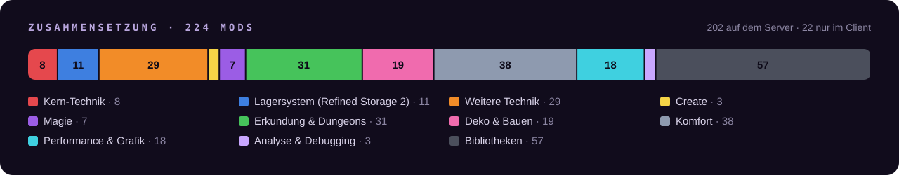
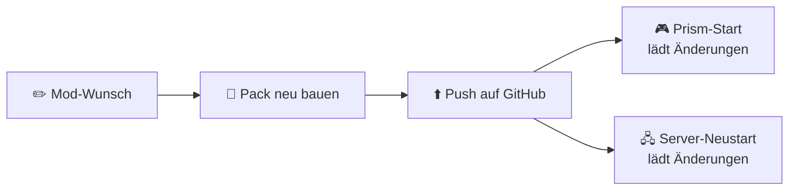

<p align="center"></p>

<p align="center">
  
  
  
  
  
  
</p>

<p align="center">
  <a href="#ueberblick"><b>Überblick</b></a> ·
  <a href="#kern"><b>Kern-Mods</b></a> ·
  <a href="#performance"><b>Performance</b></a> ·
  <a href="#installation"><b>Installation</b></a> ·
  <a href="#server"><b>Server</b></a> ·
  <a href="#updates"><b>Updates</b></a> ·
  <a href="#mods"><b>Alle Mods</b></a>
</p>

> [!NOTE]
> **Void & Draconic** ist ein privates Tech-Modpack für eine kleine Runde von 2 bis 5 Spielern. Vorbild ist Valhelsia: viel Technik, Automatisierung und Erkundung, dazu etwas Magie und Deko. Herzstück ist ein Nachfolger des alten *Void Ore Miners* aus Environmental Tech.

<a name="ueberblick"></a>


| | |
|---|---|
| 🧩 **Mods gesamt** | **226**, davon 169 mit Inhalt und 57 Bibliotheken |
| 🖧 **Server** | 203 Mods. Die 22 reinen Client-Mods lässt der Server weg. |
| 📦 **Quellen** | 202 von Modrinth, 23 von CurseForge |
| 🎮 **Spieler** | 2 bis 5, mit AFK-Farmen und dauerhaft geladenen Chunks |
| 🧠 **RAM** | Client 8–10 GB, Server 16 GB |
| 🔄 **Updates** | Automatisch bei jedem Start über packwiz |

<p align="center"></p>


<a name="kern"></a>


| Mod | Wofür |
|---|---|
| **[Mekanism](https://modrinth.com/mod/mekanism)** + Generators, Tools, Extras | Erzverarbeitung bis 5×, Fusionsreaktor, MekaSuit |
| **[Industrial Foregoing](https://modrinth.com/mod/industrial-foregoing)** | Laser Drill, Mob- und Pflanzen-Automatisierung |
| **[Refined Storage 2](https://modrinth.com/mod/refined-storage)** + ExtraStorage, Cable Tiers, Universal Grid | Lagersystem mit Autocrafting, auch für Mekanism-Chemikalien |
| **[Draconic Evolution](https://modrinth.com/mod/draconic-evolution)** | Draconic-Reaktor, Energy Core, Fusion Crafting, Endgame-Rüstung |
| **[Void Miners Remastered](https://www.curseforge.com/minecraft/mc-mods/void-miners-remastered)** | Nachfolger des Void Ore Miners: Multiblock, der Erze aus der Leere holt |

<p align="center"></p>

### Was sonst noch drin ist

- 💾 **Lagersystem (Refined Storage 2)** (11): Refined Storage 2, RS – JEI Integration, RS – Mekanism Integration, RS – Curios Integration, RS – Quartz Arsenal, Universal Grid …
- 🔌 **Weitere Technik** (29): Powah!, Flux Networks, Immersive Engineering, Ender IO, XNet, Pipez …
- 🏭 **Create** (3): Create, Create Crafts & Additions, Sophisticated Backpacks Create Integration
- ✨ **Magie** (7): Ars Nouveau, Mystical Agriculture, Mystical Agradditions, Occultism, Iron's Spells 'n Spellbooks, Forbidden & Arcanus …
- 🗺️ **Erkundung & Dungeons** (31): Valhelsia Structures, YUNG's Better Dungeons, YUNG's Better Mineshafts, YUNG's Better Strongholds, YUNG's Better Nether Fortresses, YUNG's Better Ocean Monuments …
- 🪑 **Deko & Bauen** (19): Valhelsia Furniture, Macaw's Furniture, Macaw's Doors, Macaw's Windows, Macaw's Bridges, Macaw's Roofs …
- 🎒 **Komfort** (39): JEI, Jade, Xaero's Minimap, Xaero's World Map, FTB Chunks, FTB Ultimine …
- 🚀 **Performance & Grafik** (19): Sodium, ImmediatelyFast, Entity Culling, More Culling, BadOptimizations, Dynamic FPS …
- 🔍 **Analyse & Debugging** (3): spark, Observable, Crash Assistant

<a name="performance"></a>


Ein Pack mit 226 Mods braucht Optimierung. 19 Mods kümmern sich nur darum, dazu kommen 3 Werkzeuge zur Analyse.

<table>
<tr><th>🖥️ Nur im Client (mehr FPS)</th><th>🖧 Client und Server (TPS, RAM, Stabilität)</th></tr>
<tr><td valign="top">

- **Sodium**: Deutlich mehr FPS.
- **ImmediatelyFast**: Schnelleres Zeichnen von Text und Oberflächen.
- **Entity Culling**: Zeichnet nichts, was hinter Wänden liegt.
- **More Culling**: Spart bei Blättern und vielen Blockseiten.
- **BadOptimizations**: Viele kleine Optimierungen bei Licht und Himmel.
- **Dynamic FPS**: Drosselt das Spiel im Hintergrund, ideal beim AFK-Farmen.
- **Sodium Extra**: Mehr Grafikoptionen für Sodium und ein FPS-Overlay (Videoeinstellungen → Extras → FPS anzeigen).

</td><td valign="top">

- **ModernFix**: Schnellerer Start, weniger RAM.
- **FerriteCore**: Weniger RAM-Verbrauch.
- **AllTheLeaks**: Behebt Speicherlecks verschiedener Mods.
- **Structure Layout Optimizer**: Schnellere Generierung großer Strukturen.
- **FastSuite**: Schnellere Rezeptsuche in Maschinen.
- **FastWorkbench**: Schnellere Werkbank und Autocrafting.
- **FastFurnace**: Schnellere Rezeptsuche in Öfen.
- **Let Me Despawn**: Mobs mit aufgehobenen Items verschwinden trotzdem. Weniger Entities.
- **Packet Fixer**: Verhindert Kicks bei großen ME-Terminals und vollen Rucksäcken.
- **Neruina**: Fängt fehlerhafte Mobs und Blöcke ab, statt die Welt abstürzen zu lassen.
- **Noisium**: Nur Server. Schnellere Gelände-Berechnung bei der Weltgenerierung.
- **C2ME**: Nur Server. Verteilt die Weltgenerierung auf alle Kerne, auf unserem Server rund 6× schneller. Alpha-Version.

</td></tr>
</table>

**Analyse & Debugging**

- **spark**: Profiler für TPS, MSPT, RAM und Lag-Verursacher. Pflicht.
- **Observable**: Zeigt Lag als Heatmap direkt in der Welt.
- **Crash Assistant**: Erklärt Abstürze und lädt Logs zum Teilen hoch.

> [!TIP]
> Lag? `/spark tps` zeigt die Auslastung. `/spark profiler start --timeout 120` findet die Farm, die am meisten Leistung frisst.

<details><summary><b>Optional, nicht im Pack</b></summary>

Kann bei Bedarf dazukommen. Iris kann jeder auch nur bei sich installieren.

- **[Iris Shaders](https://modrinth.com/mod/iris)**: Nur Client. Für Shader wie Complementary.
- **[Distant Horizons](https://modrinth.com/mod/distanthorizons)**: Nur Client. Sehr weite Sicht, braucht starke Grafikkarte und viel RAM.
- **[Fast IP Ping](https://modrinth.com/mod/fast-ip-ping)**: Nur Client. Server-Liste lädt schneller.
- **[Ksyxis](https://modrinth.com/mod/ksyxis)**: Welt lädt beim Betreten schneller.
- **[Lithium](https://modrinth.com/mod/lithium)**: Optimiert Physik und Mobs. Zuerst auf einer Testwelt ausprobieren.
- **[ServerCore](https://modrinth.com/mod/servercore)**: Nur Server. Passt Sichtweite und Mob-Limits bei Last automatisch an.
- **[Alternate Current](https://modrinth.com/mod/alternate-current)**: Schnellere Redstone-Berechnung.
- **[BetterF3](https://modrinth.com/mod/betterf3)**: Nur Client. Aufgeräumter F3-Bildschirm.
- **[Log Begone](https://modrinth.com/mod/log-begone)**: Filtert Log-Spam, damit echte Fehler auffallen.
- **[Catalogue](https://www.curseforge.com/minecraft/search?class=mc-mods&search=Catalogue%20MrCrayfish)**: Nur Client. Übersichtliche Mod-Liste im Spiel.
- **[Configured](https://www.curseforge.com/minecraft/search?class=mc-mods&search=Configured%20MrCrayfish)**: Nur Client. Mod-Einstellungen im Spiel ändern.

</details>


<a name="installation"></a>


Empfohlen: **[Prism Launcher](https://prismlauncher.org/)**. Einmal importieren, danach kommt jedes Update von allein.

### ⚡ Schnell: fertige Instanz importieren

1. In Prism oben links auf **Instanz hinzufügen** klicken und links **Importieren** wählen.
2. Diesen Link einfügen und mit **OK** bestätigen:

   ```
   https://github.com/Bresqwik/void-draconic-pack/releases/latest/download/Void-Draconic-Prism.zip
   ```

3. **Starten.** Beim ersten Mal lädt ein Fenster alle Mods, das dauert ein paar Minuten. Danach werden bei jedem Start nur noch Änderungen geladen.
4. **Mitspielen:** Unter *Mehrspieler* steht **Void & Draconic** schon in der Liste. Fehlt der Eintrag, weil die Instanz schon eine eigene Serverliste hatte, einmal von Hand hinzufügen: `mc-void-draconic.duckdns.org`

Startbefehl, 10 GB RAM und NeoForge sind schon eingestellt. Fehlt Java 21, lässt es sich in Prism unter *Einstellungen* → *Java* herunterladen.

<p align="center"><a href="https://github.com/Bresqwik/void-draconic-pack/releases/latest/download/Void-Draconic-Prism.zip"></a></p>

<details><summary><b>Von Hand einrichten</b></summary>

1. **Neue Instanz:** In Prism *Instanz hinzufügen* wählen, dann Minecraft **1.21.1** und als Mod-Loader **NeoForge 21.1.252**.
2. **Bootstrap laden:** [`packwiz-installer-bootstrap.jar`](https://github.com/packwiz/packwiz-installer-bootstrap/releases/latest) herunterladen und in den Ordner `minecraft` der Instanz legen. Den Ordner öffnet ein Rechtsklick auf die Instanz → *Ordner*.
3. **Startbefehl eintragen:** Rechtsklick auf die Instanz → *Bearbeiten* → *Einstellungen* → *Eigene Befehle*. Haken setzen und bei *Befehl vor dem Start* eintragen:

   ```
   "$INST_JAVA" -jar packwiz-installer-bootstrap.jar https://raw.githubusercontent.com/Bresqwik/void-draconic-pack/main/pack.toml
   ```

4. **Speicher:** Unter *Einstellungen* → *Java* den Wert *Maximaler Speicher* auf **8192–10240 MB** setzen.
5. **Starten.** Beim ersten Mal lädt ein Fenster alle Mods, das dauert ein paar Minuten. Danach werden bei jedem Start nur noch Änderungen geladen.

</details>


<a name="server"></a>


**Adresse:** `mc-void-draconic.duckdns.org` · Linux-Mietserver mit 12 Kernen, 32 GB RAM, Debian 12. Die Welt ist vorgeneriert (Oberwelt Radius 10.000, Nether und End 2000). Backups alle 4 Stunden mit Spielern, dazu täglich um 04:00 mit Kopie in Google Drive.

> [!TIP]
> **Betrieb und Neuaufbau:** Bedienung, Backups, Zurückspielen und Zugangsdaten stehen in [`SERVER-START.md`](SERVER-START.md). Auf einem frischen Linux-Server baut ein einziger Befehl den kompletten Stand nach (Minecraft, Dashboard, Backups, DuckDNS):
>
> ```bash
> curl -fsSL https://raw.githubusercontent.com/Bresqwik/void-draconic-pack/main/server/setup-linux.sh -o setup-linux.sh && ACCEPT_EULA=yes bash setup-linux.sh
> ```

| Bereich | Minimum | Empfohlen |
|---|---|---|
| Prozessor | 4 Kerne mit guter Einzelkernleistung | 6+ Kerne über 4,5 GHz, keine geteilten vCPUs |
| RAM für Minecraft | 10 GB | 12 GB, bei vielen Farmen bis 14 GB |
| RAM im Rechner | 16 GB | 24–32 GB |
| Speicher | 50 GB SSD | 100–200 GB NVMe plus Backup-Ziel woanders |
| Java | 21 | Eclipse Temurin 21 |
| Ports | 25565 TCP | dazu 24454 UDP für Simple Voice Chat |

**Voreinstellungen** aus dem Server-Paket: Whitelist an, Fliegen erlaubt, Sichtweite 10, Simulationsweite 8, kein Spawn-Schutz.

**Werkzeuge für Admins**

| Mod | Wofür |
|---|---|
| FTB Chunks | Claims und Forceload, standardmäßig 25 Chunks pro Spieler. Damit Farmen offline weiterlaufen: `force_load_mode = always` |
| FTB Ranks + FTB Essentials | Ränge und Rechte, `/home`, `/tpa`, `/back`, `/spawn` |
| Simple Backups | Automatische Welt-Backups |
| Chunky | Welt vorgenerieren: `chunky radius 3000`, dann `chunky start` |
| spark + Observable | Lag finden |

**Auto-Update:** Die Startskripte in [`server/`](server/) laden vor jedem Start die neueste Pack-Version. Client-Mods lassen sie dabei weg. Von Hand geht das so:

```
java -jar packwiz-installer-bootstrap.jar -g -s server https://raw.githubusercontent.com/Bresqwik/void-draconic-pack/main/pack.toml
```

<details><summary><b>Die 22 reinen Client-Mods</b> (nicht auf dem Server)</summary>

- `BadOptimizations-2.4.1-1.21.1.jar`
- `Controlling-neoforge-1.21.1-19.0.5.jar`
- `CrashAssistant-neoforge-1.20.6-1.21.4-1.11.12.jar`
- `ImmediatelyFast-NeoForge-1.6.14+1.21.1.jar`
- `InventoryProfilesNext-neoforge-1.21.1-2.2.5.jar`
- `JustEnoughResources-NeoForge-1.21.1-1.6.0.12.jar`
- `MouseTweaks-neoforge-mc1.21-2.26.1.jar`
- `Neat-1.21-47-NEOFORGE.jar`
- `Notes-1.21-3.0.1-neoforge.jar`
- `Searchables-neoforge-1.21.1-1.0.2.jar`
- `athena-neoforge-1.21.1-4.0.6.jar`
- `chat_heads-0.15.7-neoforge-1.21.jar`
- `clienttweaks-neoforge-1.21.1-21.1.15.jar`
- `dynamic-fps-3.11.4+minecraft-1.21.0-neoforge.jar`
- `entityculling-neoforge-1.11.2-mc1.21.1.jar`
- `fusion-1.3.15b-neoforge-mc1.21.1.jar`
- `inventoryhud.neoforged.1.21.1-3.4.28.jar`
- `jeed-1.21-2.3.4-neoforge.jar`
- `libIPN-neoforge-1.21.1-6.6.3.jar`
- `moreculling-neoforge-1.21.1-1.0.10.jar`
- `seamless-loading-screen-2.2.1+1.21-neoforge.jar`
- `sodium-extra-neoforge-0.9.4+mc1.21.1.jar`
- `sodium-neoforge-0.8.13+mc1.21.1.jar`

</details>


<a name="updates"></a>




> [!IMPORTANT]
> Client und Server müssen dieselbe Version haben. Nach einem Update also beide neu starten.


<a name="mods"></a>


⭐ Lieblingsmod · 🖥️ nur im Client

<details><summary><b>⚙️ Kern-Technik</b> · 12</summary>

*Eure Lieblinge und der Void Miner. Das ist das Herz des Packs.*

| Mod | Info | Quelle |
|---|---|---|
| [Mekanism](https://modrinth.com/mod/mekanism) ⭐ | Maschinen, Erzverarbeitung bis 5×, MekaSuit. | Modrinth |
| [Mekanism Generators](https://modrinth.com/mod/mekanism-generators) ⭐ | Turbine, Spalt- und Fusionsreaktor. | Modrinth |
| [Mekanism Tools](https://modrinth.com/mod/mekanism-tools) | Werkzeuge und Rüstung aus Osmium und anderen Metallen. | Modrinth |
| [Mekanism Extras](https://www.curseforge.com/minecraft/mc-mods/mekanism-extras) | Höhere Stufen für Leitungen, Tanks und Factories. | CurseForge |
| [Mekanism: More Machine](https://modrinth.com/mod/mekanismmoremachine) | Zusätzliche Mekanism-Maschinen. | Modrinth |
| [Industrial Foregoing](https://modrinth.com/mod/industrial-foregoing) ⭐ | Laser Drill, Mob-Farmen, Pflanzen-Automatisierung. | Modrinth |
| [Titanium](https://modrinth.com/mod/titanium) | Für Industrial Foregoing. | Modrinth |
| [Draconic Evolution](https://modrinth.com/mod/draconic-evolution) ⭐ | Draconic-Reaktor, Energy Core, Fusion Crafting, Endgame-Rüstung. | Modrinth |
| [Mango's Multiblock Library Revived](https://www.curseforge.com/minecraft/mc-mods/mangos-multiblock-library-revived) | Für Void Miners Remastered (ab 3.0.1). | CurseForge |
| [Brandon's Core](https://modrinth.com/mod/brandons-core) | Für Draconic Evolution. | Modrinth |
| [CodeChicken Lib](https://modrinth.com/mod/codechicken-lib) | Für Draconic Evolution. | Modrinth |
| [Void Miners Remastered](https://www.curseforge.com/minecraft/mc-mods/void-miners-remastered) ⭐ | Nachfolger des Void Ore Miners: 9 Kristallstufen, Multiblock, Solar-Arrays. Baut auch Mekanism-Erze und Draconium ab. | CurseForge |

</details>

<details><summary><b>💾 Lagersystem (Refined Storage 2)</b> · 12</summary>

*Refined Storage 2 mit Addons: größere Disks, schnellere Busse, Wireless Grids, Mekanism-Chemikalien und JEI-Rezeptübertragung.*

| Mod | Info | Quelle |
|---|---|---|
| [Refined Storage 2](https://modrinth.com/mod/refined-storage) ⭐ | Das Lagersystem: Disks, Grids und Autocrafting, übersichtlicher als AE2. | Modrinth |
| [RS – JEI Integration](https://modrinth.com/mod/refined-storage-jei-integration) | Rezepte aus JEI direkt ins Crafting Grid und in Muster übertragen. | Modrinth |
| [RS – Mekanism Integration](https://modrinth.com/mod/refined-storage-mekanism-integration) | Mekanism-Chemikalien speichern, transportieren und autocraften. | Modrinth |
| [RS – Curios Integration](https://modrinth.com/mod/refined-storage-curios-integration) | Zwei Curios-Slots für Wireless Grids. | Modrinth |
| [RS – Quartz Arsenal](https://modrinth.com/mod/refined-storage-quartz-arsenal) | Wireless Crafting Grid und weitere Werkzeuge. | Modrinth |
| [Universal Grid](https://modrinth.com/mod/universal-grid) | Ein Wireless-Grid, umschaltbar zwischen Grid, Crafting Grid und Autocrafting-Monitor. | Modrinth |
| [Refined Wireless Upgrades](https://modrinth.com/mod/refined-wireless-upgrades) | Upgrades fürs Wireless Grid: Inventar einlagern, Items einsammeln, Block-Picker, mehr Energie. | Modrinth |
| [ExtraStorage](https://modrinth.com/mod/extrastorage) | Größere Disks, schnellere Autocrafter, erweiterte Importer und Exporter. | Modrinth |
| [EdivadLib](https://modrinth.com/mod/edivadlib) | Für ExtraStorage. | Modrinth |
| [Cable Tiers](https://modrinth.com/mod/cable-tiers) | Schnellere Importer, Exporter, Constructor und Autocrafter in mehreren Stufen. | Modrinth |
| [PackagedAuto](https://modrinth.com/mod/packagedauto) | Autocrafting für große Rezepte. | Modrinth |
| [PackagedDraconic](https://modrinth.com/mod/packageddraconic) | Automatisiert Draconic Fusion Crafting mit PackagedAuto. | Modrinth |

</details>

<details><summary><b>🔌 Weitere Technik</b> · 30</summary>

*Strom, Transport und Werkzeuge, die gut mit Mekanism und Refined Storage zusammenspielen.*

| Mod | Info | Quelle |
|---|---|---|
| [Powah!](https://modrinth.com/mod/powah) | Einfacher Strom früh im Spiel, Reaktoren und Energiezellen. | Modrinth |
| [Flux Networks](https://www.curseforge.com/minecraft/mc-mods/flux-networks) | Kabelloser Strom über die ganze Basis und Dimensionen. | CurseForge |
| [Immersive Engineering](https://modrinth.com/mod/immersiveengineering) | Große Multiblock-Maschinen im Industrie-Look. | Modrinth |
| [Ender IO](https://modrinth.com/mod/enderio) | Conduits, Alloy Smelter, SAG Mill. | Modrinth |
| [XNet](https://modrinth.com/mod/xnet) | Logistik-Netzwerk für Items, Flüssigkeiten und Strom. | Modrinth |
| [Pipez](https://modrinth.com/mod/pipez) | Einfache, schnelle Rohre. | Modrinth |
| [Laser IO](https://www.curseforge.com/minecraft/mc-mods/laserio) | Kabelloser Item- und Flüssigkeitstransport mit Filtern. | CurseForge |
| [Functional Storage](https://modrinth.com/mod/functional-storage) | Schubladen-Speicher, gut für Void-Miner-Ausgabe. | Modrinth |
| [Hostile Neural Networks](https://modrinth.com/mod/hostile-neural-networks) | Mob-Drops ohne Mob-Farm simulieren. | Modrinth |
| [Just Dire Things](https://www.curseforge.com/minecraft/mc-mods/just-dire-things) | Werkzeuge, Generatoren und Automatisierungsblöcke von Direwolf20. | CurseForge |
| [Mining Gadgets](https://www.curseforge.com/minecraft/mc-mods/mining-gadgets) | Abbau-Laser mit Upgrades. | CurseForge |
| [Iron Jetpacks](https://modrinth.com/mod/iron-jetpacks) | Jetpacks schon früh im Spiel, in Stufen aufrüstbar, mit FE-Strom. Kommt in den Curios-Slot. | Modrinth |
| [Pocket Storage](https://www.curseforge.com/minecraft/mc-mods/pocket-storage) | Tragbarer Massenspeicher von Flanks255 (bis 1 Mio. Items pro Slot). Nicht die gleichnamige Mod auf Modrinth. | CurseForge |
| [Building Gadgets 2](https://www.curseforge.com/minecraft/mc-mods/building-gadgets) | Große Flächen und Kopien auf einmal bauen. Auf CurseForge heißt das Projekt nur „Building Gadgets“, die 1.21.1-Dateien sind BuildingGadgets2. | CurseForge |
| [PneumaticCraft: Repressurized](https://modrinth.com/mod/pneumaticcraft-repressurized) | Aus Valhelsia 3. Druckluft-Technik, Drohnen, Ölverarbeitung. | Modrinth |
| [Immersive Petroleum](https://modrinth.com/mod/immersivepetroleum) | Aus Valhelsia 3. Öl und Diesel für Immersive Engineering. | Modrinth |
| [Immersive Posts](https://modrinth.com/mod/immersiveposts) | Aus Valhelsia 3. Strommasten für Immersive Engineering. | Modrinth |
| [Ender Storage](https://www.curseforge.com/minecraft/mc-mods/ender-storage-1-8) | Aus Valhelsia 3. Farbcodierte Ender-Truhen und -Tanks, praktisch zum Teilen. | CurseForge |
| [Torchmaster](https://modrinth.com/mod/torchmaster) | Aus Valhelsia 3. Verhindert Mob-Spawns in großem Radius. | Modrinth |
| [Botany Pots](https://modrinth.com/mod/botany-pots) | War ein Extra. Pflanzen automatisch in Töpfen anbauen. | Modrinth |
| [Botany Pots Tiers](https://modrinth.com/mod/botany-pots-tiers) | War ein Extra. Schnellere Töpfe. | Modrinth |
| [Botany Trees](https://modrinth.com/mod/botany-trees) | Aus der Mod-Wahl. Bäume in Botany Pots anbauen. | Modrinth |
| [Cyclic](https://modrinth.com/mod/cyclic) | Aus der RAR. Viele kleine Maschinen, Werkzeuge und Blöcke. | Modrinth |
| [FLIB](https://modrinth.com/mod/flib) | Für Cyclic (ab 0.2.9). Wird auf Modrinth nicht als Abhängigkeit gemeldet. | Modrinth |
| [RFTools Utility](https://modrinth.com/mod/rftools-utility) | Aus der RAR. Teleporter, Bildschirme, Umgebungsmodule. Beta. | Modrinth |
| [RFTools Builder](https://modrinth.com/mod/rftools-builder) | Aus der RAR. Builder und Quarry mit Shape Cards. Beta. | Modrinth |
| [CC: Tweaked](https://modrinth.com/mod/cc-tweaked) | Aus der Mod-Wahl. Programmierbare Computer und Turtles. Für 1.21.1 nur Alpha. | Modrinth |
| [Advanced Peripherals](https://modrinth.com/mod/advancedperipherals) | Aus der Mod-Wahl. Verbindet CC: Tweaked mit Mekanism und mehr. Für 1.21.1 nur Alpha. | Modrinth |
| [Dark Utilities](https://modrinth.com/mod/dark-utilities) | Aus der Mod-Wahl. Mob-Fallen, Vektorplatten, nützliche Kleinigkeiten. | Modrinth |
| [Modular Angel Ring](https://www.curseforge.com/minecraft/mc-mods/modular-angel-ring) | Aus der Mod-Wahl. Fliegen per Ring, mit Modulen erweiterbar. | CurseForge |

</details>

<details><summary><b>🏭 Create</b> · 3</summary>

*Mechanische Automatisierung, wie in Valhelsia.*

| Mod | Info | Quelle |
|---|---|---|
| [Create](https://modrinth.com/mod/create) | Zahnräder, Förderbänder, Züge. | Modrinth |
| [Create Crafts & Additions](https://modrinth.com/mod/createaddition) | Verbindet Create mit FE-Strom. | Modrinth |
| [Sophisticated Backpacks Create Integration](https://modrinth.com/mod/sophisticated-backpacks-create-integration) | Aus der Mod-Wahl. Rucksäcke auf Create-Fahrzeugen. | Modrinth |

</details>

<details><summary><b>✨ Magie</b> · 9</summary>

*Magie-Mods mit Anbindung an Automatisierung.*

| Mod | Info | Quelle |
|---|---|---|
| [Ars Nouveau](https://modrinth.com/mod/ars-nouveau) | Zauber selbst zusammenbauen. War auch in Valhelsia. | Modrinth |
| [Mystical Agriculture](https://modrinth.com/mod/mystical-agriculture) | Ressourcen als Pflanzen anbauen. | Modrinth |
| [Mystical Agradditions](https://modrinth.com/mod/mystical-agradditions) | Höhere Stufen für Mystical Agriculture. | Modrinth |
| [Occultism](https://modrinth.com/mod/occultism) | Geister beschwören, die für euch arbeiten und sortieren. | Modrinth |
| [Iron's Spells 'n Spellbooks](https://modrinth.com/mod/irons-spells-n-spellbooks) | Kampfmagie mit Bossen und Zauberbüchern. | Modrinth |
| [playerAnimator](https://modrinth.com/mod/playeranimator) | Für Iron's Spells. Wird auf Modrinth nicht als Abhängigkeit gemeldet. | Modrinth |
| [Iron's Lib](https://modrinth.com/mod/irons-lib) | Für Iron's Spells, Version 1.21.1-2.x. | Modrinth |
| [Forbidden & Arcanus](https://modrinth.com/mod/forbidden-arcanus) | Dunkle Magie und Rituale. | Modrinth |
| [Apotheosis](https://modrinth.com/mod/apotheosis) | Besseres Verzaubern, Edelsteine, Beute-Affixe. | Modrinth |

</details>

<details><summary><b>🗺️ Erkundung & Dungeons</b> · 33</summary>

*Strukturen, Biome, Dimensionen und Bosse. Valhelsia Structures sorgt für das bekannte Valhelsia-Gefühl.*

| Mod | Info | Quelle |
|---|---|---|
| [Valhelsia Structures](https://modrinth.com/mod/valhelsia-structures) ⭐ | Die Strukturen aus den Valhelsia-Packs. | Modrinth |
| [YUNG's API](https://modrinth.com/mod/yungs-api) | Für alle YUNG's-Mods. | Modrinth |
| [YUNG's Better Dungeons](https://modrinth.com/mod/yungs-better-dungeons) | – | Modrinth |
| [YUNG's Better Mineshafts](https://modrinth.com/mod/yungs-better-mineshafts) | – | Modrinth |
| [YUNG's Better Strongholds](https://modrinth.com/mod/yungs-better-strongholds) | – | Modrinth |
| [YUNG's Better Nether Fortresses](https://modrinth.com/mod/yungs-better-nether-fortresses) | – | Modrinth |
| [YUNG's Better Ocean Monuments](https://modrinth.com/mod/yungs-better-ocean-monuments) | – | Modrinth |
| [YUNG's Better Desert Temples](https://modrinth.com/mod/yungs-better-desert-temples) | – | Modrinth |
| [YUNG's Better Jungle Temples](https://modrinth.com/mod/yungs-better-jungle-temples) | – | Modrinth |
| [YUNG's Better End Island](https://modrinth.com/mod/yungs-better-end-island) | – | Modrinth |
| [YUNG's Better Caves](https://modrinth.com/mod/yungs-better-caves) | Aus der Mod-Wahl. Überarbeitete Höhlen mit Seen und Flüssen. | Modrinth |
| [YUNG's Extras](https://modrinth.com/mod/yungs-extras) | Aus der Mod-Wahl. Euer altes Extra. Kleine Strukturen. | Modrinth |
| [Terralith](https://modrinth.com/mod/terralith) | Über 100 neue Biome ohne neue Blöcke. | Modrinth |
| [Tectonic](https://modrinth.com/mod/tectonic) | Berge, Täler und tiefere Ozeane. | Modrinth |
| [Biomes O' Plenty](https://modrinth.com/mod/biomes-o-plenty) | Aus der Mod-Wahl. Über 50 Biome. Für 1.21.1 Beta. Zusammen mit Terralith und Oh The Biomes We've Gone wird die Weltgenerierung schwerer. | Modrinth |
| [Oh The Biomes We've Gone](https://modrinth.com/mod/oh-the-biomes-weve-gone) | Aus der Mod-Wahl. Nachfolger von Oh The Biomes You'll Go (euer altes Extra). | Modrinth |
| [Explorify](https://modrinth.com/mod/explorify) | Kleine Vanilla-Strukturen überall. | Modrinth |
| [Towns and Towers](https://modrinth.com/mod/towns-and-towers) | Bessere Dörfer und Außenposten. | Modrinth |
| [Dungeons and Taverns](https://modrinth.com/mod/dungeons-and-taverns) | Tavernen, Ruinen und Dungeons. | Modrinth |
| [When Dungeons Arise](https://modrinth.com/mod/when-dungeons-arise) | Riesige Dungeons und Schlösser. | Modrinth |
| [Integrated Dungeons and Structures](https://modrinth.com/mod/idas) | Große, detaillierte Strukturen. | Modrinth |
| [L_Ender's Cataclysm](https://modrinth.com/mod/l_enders-cataclysm) | Große Bosskämpfe. | Modrinth |
| [The Twilight Forest](https://www.curseforge.com/minecraft/mc-mods/the-twilight-forest) | Klassische Abenteuer-Dimension mit Boss-Reihenfolge. | CurseForge |
| [The Aether](https://modrinth.com/mod/aether) | Himmels-Dimension mit Dungeons. | Modrinth |
| [Deeper and Darker](https://modrinth.com/mod/deeperdarker) | Otherside-Dimension hinter der Ancient City. | Modrinth |
| [Mowzie's Mobs](https://modrinth.com/mod/mowzies-mobs) | Aufwendig animierte Bosse und Mobs. | Modrinth |
| [Aquamirae](https://modrinth.com/mod/aquamirae) | Eisiges Meer mit Bossen. War auch in Valhelsia 6. | Modrinth |
| [Artifacts](https://modrinth.com/mod/artifacts) | Seltene Ausrüstungsgegenstände in Truhen. | Modrinth |
| [Waystones](https://modrinth.com/mod/waystones) | Schnellreise zwischen Wegsteinen. | Modrinth |
| [Framework](https://www.curseforge.com/minecraft/mc-mods/framework) | Library für Goblin Traders. | CurseForge |
| [Goblin Traders](https://www.curseforge.com/minecraft/mc-mods/goblin-traders) | Aus der Mod-Wahl. Händler-Goblins unter Tage. | CurseForge |
| [Nature's Compass](https://modrinth.com/mod/natures-compass) | Biome finden. | Modrinth |
| [Explorer's Compass](https://modrinth.com/mod/explorers-compass) | Strukturen finden. | Modrinth |

</details>

<details><summary><b>🪑 Deko & Bauen</b> · 19</summary>

*Möbel, Blockvarianten und Bau-Werkzeuge.*

| Mod | Info | Quelle |
|---|---|---|
| [Valhelsia Furniture](https://modrinth.com/mod/valhelsia-furniture) | Möbel aus den Valhelsia-Packs. | Modrinth |
| [Macaw's Furniture](https://modrinth.com/mod/macaws-furniture) | – | Modrinth |
| [Macaw's Doors](https://modrinth.com/mod/macaws-doors) | – | Modrinth |
| [Macaw's Windows](https://modrinth.com/mod/macaws-windows) | – | Modrinth |
| [Macaw's Bridges](https://modrinth.com/mod/macaws-bridges) | – | Modrinth |
| [Macaw's Roofs](https://modrinth.com/mod/macaws-roofs) | – | Modrinth |
| [Macaw's Lights and Lamps](https://modrinth.com/mod/macaws-lights-and-lamps) | – | Modrinth |
| [Macaw's Paths and Pavings](https://modrinth.com/mod/macaws-paths-and-pavings) | – | Modrinth |
| [Macaw's Fences and Walls](https://modrinth.com/mod/macaws-fences-and-walls) | Aus Valhelsia 3.  | Modrinth |
| [Macaw's Trapdoors](https://modrinth.com/mod/macaws-trapdoors) | Aus Valhelsia 3.  | Modrinth |
| [Chipped](https://modrinth.com/mod/chipped) | Tausende Blockvarianten. | Modrinth |
| [Chalk](https://modrinth.com/mod/chalk-mod) | Aus der Mod-Wahl. Mit Kreide auf Blöcke zeichnen. | Modrinth |
| [Rechiseled](https://modrinth.com/mod/rechiseled) | Meißel mit verbundenen Texturen. | Modrinth |
| [Supplementaries](https://modrinth.com/mod/supplementaries) | Viele kleine Deko- und Funktionsblöcke. | Modrinth |
| [Amendments](https://modrinth.com/mod/amendments) | Ergänzt Supplementaries um Vanilla-Verbesserungen. | Modrinth |
| [Handcrafted](https://modrinth.com/mod/handcrafted) | Gemütliche Möbel. | Modrinth |
| [FramedBlocks](https://modrinth.com/mod/framedblocks) | Blöcke in beliebiger Textur und Form. | Modrinth |
| [Farmer's Delight](https://modrinth.com/mod/farmers-delight) | Kochen und Landwirtschaft. | Modrinth |
| [Quark](https://modrinth.com/mod/quark) | Viele kleine Vanilla-Erweiterungen. Kann man weglassen, wenn es zu viel wird. | Modrinth |

</details>

<details><summary><b>🎒 Komfort</b> · 42</summary>

*Rezepte, Karten, Rucksäcke und Inventar-Hilfen.*

| Mod | Info | Quelle |
|---|---|---|
| [JEI](https://modrinth.com/mod/jei) | Rezepte anzeigen. Pflicht. | Modrinth |
| [Jade](https://modrinth.com/mod/jade) | Zeigt an, worauf man schaut, inklusive Void-Miner-Status. | Modrinth |
| [Xaero's Minimap](https://modrinth.com/mod/xaeros-minimap) | – | Modrinth |
| [Xaero's World Map](https://modrinth.com/mod/xaeros-world-map) | – | Modrinth |
| [FTB Library](https://www.curseforge.com/minecraft/mc-mods/ftb-library-forge) | Für FTB Chunks, Ultimine und Essentials. | CurseForge |
| [FTB Teams](https://www.curseforge.com/minecraft/mc-mods/ftb-teams-forge) | Für FTB Chunks. | CurseForge |
| [FTB Chunks](https://www.curseforge.com/minecraft/mc-mods/ftb-chunks-forge) | Chunks sichern und geladen halten, wichtig für Maschinen. | CurseForge |
| [FTB Ultimine](https://www.curseforge.com/minecraft/mc-mods/ftb-ultimine-forge) | Viele Blöcke auf einmal abbauen. | CurseForge |
| [FTB Quests](https://www.curseforge.com/minecraft/mc-mods/ftb-quests-forge) | Questbuch mit Aufgaben und Belohnungen, gemeinsam im Team. | CurseForge |
| [FTB Essentials](https://www.curseforge.com/minecraft/mc-mods/ftb-essentials) | Server-Befehle: /home, /back, /tpa, /spawn, /rtp. | CurseForge |
| [Simple Backups](https://modrinth.com/mod/simple-backups) | Automatische Welt-Backups mit Rotation. | Modrinth |
| [MiniMOTD](https://modrinth.com/mod/minimotd) | Nur Server. Farbige, wechselnde Server-Beschreibung mit eigenen Icons. | Modrinth |
| [FTB Ranks](https://www.curseforge.com/minecraft/mc-mods/ftb-ranks-forge) | Aus der Mod-Wahl. Ränge, z. B. mehr Forceload-Chunks. Überschneidet sich mit LuckPerms, nur eins von beiden für Rechte nutzen. | CurseForge |
| [Simple Voice Chat](https://modrinth.com/mod/simple-voice-chat) | Aus der Mod-Wahl. Sprachchat nach Entfernung. Server braucht UDP-Port 24454. | Modrinth |
| [Iron Chests](https://www.curseforge.com/minecraft/mc-mods/iron-chests) | Aus der Mod-Wahl. Klassische Metall-Truhen, zusätzlich zu Sophisticated Storage. | CurseForge |
| [Sophisticated Backpacks](https://modrinth.com/mod/sophisticated-backpacks) | – | Modrinth |
| [Sophisticated Storage](https://modrinth.com/mod/sophisticated-storage) | Aufrüstbare Truhen. | Modrinth |
| [Curios API](https://modrinth.com/mod/curios) | Extra-Slots für Ringe, Rucksäcke usw. | Modrinth |
| [Almost Unified](https://modrinth.com/mod/almostunified) | Vereinheitlicht doppelte Erze und Barren aus verschiedenen Mods. Bei so vielen Tech-Mods sehr wichtig. | Modrinth |
| [Mouse Tweaks](https://modrinth.com/mod/mouse-tweaks) 🖥️ | – | Modrinth |
| [Inventory Profiles Next](https://modrinth.com/mod/inventory-profiles-next) 🖥️ | Inventar sortieren. | Modrinth |
| [AppleSkin](https://modrinth.com/mod/appleskin) | – | Modrinth |
| [Controlling](https://modrinth.com/mod/controlling) 🖥️ | Tastenbelegung durchsuchen. | Modrinth |
| [Crafting Tweaks](https://modrinth.com/mod/crafting-tweaks) | – | Modrinth |
| [Just Enough Resources (JER)](https://modrinth.com/mod/just-enough-resources-jer) 🖥️ | Aus Valhelsia 3. Erzverteilung und Mob-Drops in JEI. Für 1.21.1 nur als Alpha. | Modrinth |
| [Enchantment Descriptions](https://modrinth.com/mod/enchantment-descriptions) | War ein Extra. Erklärt Verzauberungen. | Modrinth |
| [Just Enough Effect Descriptions](https://modrinth.com/mod/just-enough-effect-descriptions-jeed) 🖥️ | Aus Valhelsia 3. Erklärt Effekte. | Modrinth |
| [AttributeFix](https://modrinth.com/mod/attributefix) | Aus Valhelsia 3. Hebt Werte-Grenzen an, wichtig mit Apotheosis und Iron's Spells. | Modrinth |
| [Carry On](https://modrinth.com/mod/carry-on) | Aus Valhelsia 3. Truhen samt Inhalt aufheben und umstellen. | Modrinth |
| [Nether Portal Fix](https://modrinth.com/mod/netherportalfix) | War ein Extra. Portale führen zurück zum richtigen Portal. | Modrinth |
| [TrashSlot](https://modrinth.com/mod/trashslot) | Aus Valhelsia 3. Mülleimer-Slot im Inventar. | Modrinth |
| [Chat Heads](https://modrinth.com/mod/chat-heads) 🖥️ | Nur Client. Aus der Mod-Wahl. Spielerköpfe im Chat. | Modrinth |
| [Client Tweaks](https://modrinth.com/mod/client-tweaks) 🖥️ | Nur Client. Aus der Mod-Wahl. Kleine Verbesserungen an der Steuerung. | Modrinth |
| [Inventory HUD+](https://modrinth.com/mod/inventoryhudplus) 🖥️ | Nur Client. Aus der Mod-Wahl. Inventar und Effekte im HUD. | Modrinth |
| [Neat](https://modrinth.com/mod/neat) 🖥️ | Nur Client. Aus der Mod-Wahl. Lebensbalken über Mobs. | Modrinth |
| [Notes](https://modrinth.com/mod/notes) 🖥️ | Nur Client. Aus der Mod-Wahl. Notizblock im Spiel. | Modrinth |
| [Personality](https://modrinth.com/mod/personality!) | Aus der Mod-Wahl. Sitzen, kriechen und mehr Spielgefühl. | Modrinth |
| [Seamless Loading Screen](https://modrinth.com/mod/seamless-loading-screen) 🖥️ | Nur Client. Aus der Mod-Wahl. Schönere Ladebildschirme. | Modrinth |
| [Polymorph](https://modrinth.com/mod/polymorph) | Löst Rezept-Konflikte zwischen Mods. | Modrinth |
| [Clumps](https://modrinth.com/mod/clumps) | Fasst Erfahrungskugeln zusammen. | Modrinth |
| [GraveStone Mod](https://modrinth.com/mod/gravestone-mod) | Grabstein mit Todes-Infos, Todeszettel (Koordinaten, Item-Liste) und /restore-Befehl. Ersetzt Corpse. | Modrinth |
| [Chunky](https://modrinth.com/mod/chunky) | Welt vorgenerieren gegen Lag beim schnellen Fliegen. Erst laufen lassen, wenn die Modliste fertig ist. | Modrinth |

</details>

<details><summary><b>🚀 Performance & Grafik</b> · 19</summary>

*Hält ein Pack mit über 100 Mods flüssig. Details und Einstellungen stehen im Tuning-Plan.*

| Mod | Info | Quelle |
|---|---|---|
| [Sodium](https://modrinth.com/mod/sodium) 🖥️ | Nur Client. Deutlich mehr FPS. | Modrinth |
| [ImmediatelyFast](https://modrinth.com/mod/immediatelyfast) 🖥️ | Nur Client. Schnelleres Zeichnen von Text und Oberflächen. | Modrinth |
| [Entity Culling](https://modrinth.com/mod/entityculling) 🖥️ | Nur Client. Zeichnet nichts, was hinter Wänden liegt. | Modrinth |
| [More Culling](https://modrinth.com/mod/moreculling) 🖥️ | Nur Client. Spart bei Blättern und vielen Blockseiten. | Modrinth |
| [BadOptimizations](https://modrinth.com/mod/badoptimizations) 🖥️ | Nur Client. Viele kleine Optimierungen bei Licht und Himmel. | Modrinth |
| [Dynamic FPS](https://modrinth.com/mod/dynamic-fps) 🖥️ | Nur Client. Drosselt das Spiel im Hintergrund, ideal beim AFK-Farmen. | Modrinth |
| [Sodium Extra](https://modrinth.com/mod/sodium-extra) 🖥️ | Nur Client. Mehr Grafikoptionen für Sodium und ein FPS-Overlay. | Modrinth |
| [ModernFix](https://modrinth.com/mod/modernfix) | Schnellerer Start, weniger RAM. | Modrinth |
| [FerriteCore](https://modrinth.com/mod/ferrite-core) | Weniger RAM-Verbrauch. | Modrinth |
| [AllTheLeaks](https://www.curseforge.com/minecraft/mc-mods/alltheleaks) | Behebt Speicherlecks verschiedener Mods. | CurseForge |
| [Structure Layout Optimizer](https://modrinth.com/mod/structure-layout-optimizer) | Schnellere Generierung großer Strukturen. | Modrinth |
| [FastSuite](https://modrinth.com/mod/fastsuite) | Schnellere Rezeptsuche in Maschinen. | Modrinth |
| [FastWorkbench](https://modrinth.com/mod/fastworkbench) | Schnellere Werkbank und Autocrafting. | Modrinth |
| [FastFurnace](https://modrinth.com/mod/fastfurnace) | Schnellere Rezeptsuche in Öfen. | Modrinth |
| [Let Me Despawn](https://modrinth.com/mod/lmd) | Mobs mit aufgehobenen Items verschwinden trotzdem. Weniger Entities. | Modrinth |
| [Packet Fixer](https://modrinth.com/mod/packet-fixer) | Verhindert Kicks bei großen ME-Terminals und vollen Rucksäcken. | Modrinth |
| [Neruina](https://modrinth.com/mod/neruina) | Fängt fehlerhafte Mobs und Blöcke ab, statt die Welt abstürzen zu lassen. | Modrinth |
| [Noisium](https://modrinth.com/mod/noisium) | Nur Server. Schnellere Gelände-Berechnung bei der Weltgenerierung. | Modrinth |
| [C2ME](https://modrinth.com/mod/c2me-neoforge) | Nur Server. Verteilt die Weltgenerierung auf alle Kerne, auf unserem Server rund 6× schneller. Alpha-Version. | Modrinth |

</details>

<details><summary><b>🔍 Analyse & Debugging</b> · 3</summary>

*Lag messen und Abstürze verstehen. spark ist Pflicht, der Rest hilft beim Suchen.*

| Mod | Info | Quelle |
|---|---|---|
| [spark](https://modrinth.com/mod/spark) | Profiler für TPS, MSPT, RAM und Lag-Verursacher. Pflicht. | Modrinth |
| [Observable](https://modrinth.com/mod/observable) | Zeigt Lag als Heatmap direkt in der Welt. | Modrinth |
| [Crash Assistant](https://modrinth.com/mod/crash-assistant) 🖥️ | Nur Client. Erklärt Abstürze und lädt Logs zum Teilen hoch. | Modrinth |

</details>

<details><summary><b>📚 Weitere Bibliotheken</b> · 44</summary>

Werden von anderen Mods gebraucht und laufen im Hintergrund.

`Almanac`, `ApothicAttributes`, `ApothicEnchanting`, `ApothicSpawners`, `Corgilib`, `Cucumber`, `GlitchCore`, `Oh The Trees Youll Grow`, `Patchouli`, `Placebo`, `Searchables`, `SmartBrainLib`, `TerraBlender`, `Zeta`, `architectury`, `athena`, `balm`, `blueprint`, `bookshelf`, `cloth config`, `configurable`, `cristellib`, `fragmentum`, `fusion`, `geckolib`, `guideme`, `integrated api`, `kotlinforforge`, `libIPN`, `lionfishapi`, `lithostitched`, `mcjtylib`, `modonomicon`, `moonlight`, `owo lib neoforge`, `prickle`, `resourcefulconfig`, `resourcefullib`, `rftoolsbase`, `sophisticatedcore`, `supermartijn642configlib`, `supermartijn642corelib`, `valhelsia core`, `yet another config lib v3`

</details>

---

<p align="center"><sub>Alle Mods gehören ihren Autorinnen und Autoren. Dieses Repo enthält nur Links und Prüfsummen, die Dateien kommen direkt von Modrinth und CurseForge.</sub></p>
